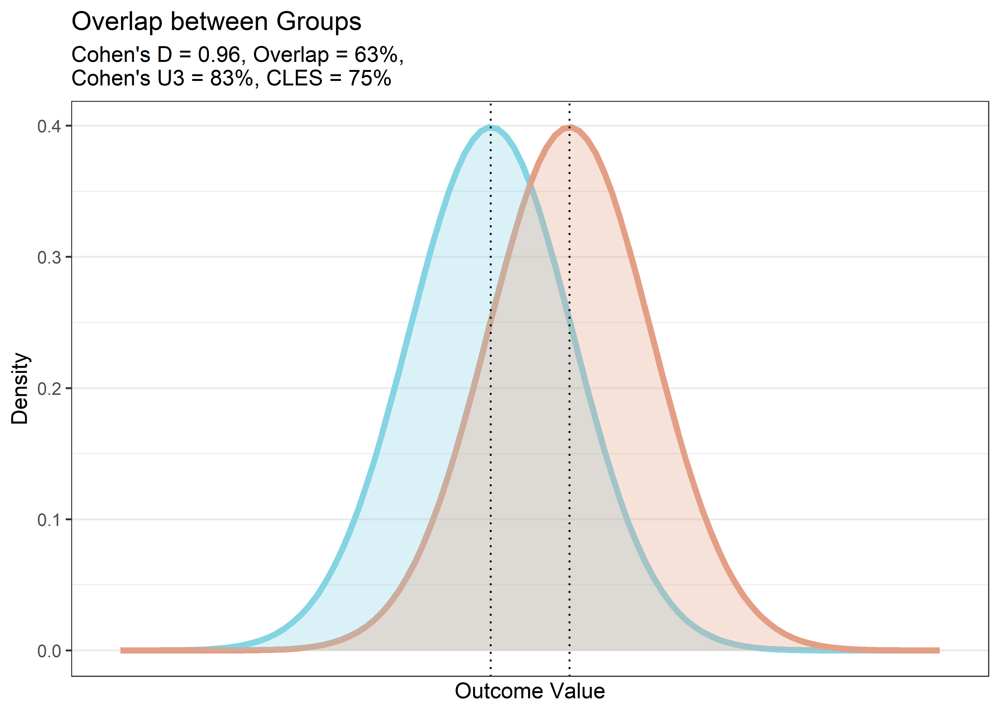

-   [Aims](#aims)
-   [Munging TACs](#munging-tacs)
    -   [Libraries](#libraries)
    -   [Data](#data)
    -   [Extract from that data](#extract-from-that-data)
    -   [Removing frames without
        participants](#removing-frames-without-participants)
-   [Exploring the Frame Properties of the
    TACs](#exploring-the-frame-properties-of-the-tacs)
-   [Are the different TAC lengths a problem? Time Stability
    analysis](#are-the-different-tac-lengths-a-problem-time-stability-analysis)
    -   [Long measurements](#long-measurements)
    -   [51 Minute Data](#minute-data)
    -   [Variance across time ranges](#variance-across-time-ranges)
-   [Binding potential analysis](#binding-potential-analysis)
    -   [Preparing the long data](#preparing-the-long-data)
    -   [Calculating BP<sub>ND</sub> values](#calculating-bpnd-values)
    -   [Correcting for bias](#correcting-for-bias)
-   [Combining the TAC data with the
    metadata](#combining-the-tac-data-with-the-metadata)
-   [Potential confounder effects](#potential-confounder-effects)
    -   [Biological confounders](#biological-confounders)
        -   [Age at PET](#age-at-pet)
        -   [Sex](#sex)
    -   [R-Z Filter](#r-z-filter)
        -   [Resolution](#resolution)
        -   [Cutoff](#cutoff)
    -   [ECAT file format](#ecat-file-format)
    -   [PET 2D vs 3D](#pet-2d-vs-3d)
    -   [NeuroInsert](#neuroinsert)
    -   [MR Modality](#mr-modality)
    -   [Date of Measurement](#date-of-measurement)
    -   [Movement during the
        measurement](#movement-during-the-measurement)
-   [Comparison between automatic and manual
    ROIs](#comparison-between-automatic-and-manual-rois)
    -   [Comparing bias between Patients and
        controls](#comparing-bias-between-patients-and-controls)
-   [Considerations prior to
    analysis](#considerations-prior-to-analysis)
    -   [Sex](#sex-1)
        -   [Karolinska Dopamine
            Database](#karolinska-dopamine-database)
        -   [de Boer et al. (2017)](#de-boer-et-al.-2017)
    -   [Age](#age)
        -   [DLPFC](#dlpfc)
        -   [Striatum](#striatum)
        -   [Conclusion](#conclusion)
    -   [Other confounders](#other-confounders)
-   [Modelling the difference](#modelling-the-difference)
    -   [Bayesian approach](#bayesian-approach)
        -   [Age](#age-1)
        -   [Patient-control status](#patient-control-status)
        -   [DLPFC Model](#dlpfc-model)
        -   [STR Model](#str-model)
        -   [BF Table](#bf-table)
    -   [Frequentist Approach](#frequentist-approach)
        -   [Power Analysis](#power-analysis)
        -   [Analysis](#analysis)

Aims
====

In this analysis, we aim to analyse the TAC data from the D1
schizophrenia control study.

The relevant issues which need to be confronted prior to analysis are:

-   Different lengths of the PET measurements
-   Different lengths of PET frames

The relevant concerns which need to be addressed during the analysis
phase are:

-   Time-stability of D1R BP<sub>ND</sub> estimates
-   Relevance of T1 and T2 MR measurements
-   Relevance of having the neuroinsert
-   Relevance of automatic and manual ROIs

Munging TACs
============

Libraries
---------

``` r
# devtools::install_github('mathesong/kipettools')
# devtools::install_github("mathesong/kinfitr", ref="v0.2.0")
library(kipettools)
library(tidyverse)
```

    ## -- Attaching packages ------------------------------------------------------------------------------------ tidyverse 1.2.1 --

    ## v ggplot2 3.1.0       v purrr   0.3.0  
    ## v tibble  2.0.1       v dplyr   0.8.0.1
    ## v tidyr   0.8.2       v stringr 1.4.0  
    ## v readr   1.3.1       v forcats 0.4.0

    ## Warning: package 'ggplot2' was built under R version 3.5.2

    ## Warning: package 'tibble' was built under R version 3.5.2

    ## Warning: package 'tidyr' was built under R version 3.5.1

    ## Warning: package 'readr' was built under R version 3.5.2

    ## Warning: package 'purrr' was built under R version 3.5.2

    ## Warning: package 'dplyr' was built under R version 3.5.2

    ## Warning: package 'stringr' was built under R version 3.5.2

    ## Warning: package 'forcats' was built under R version 3.5.2

    ## -- Conflicts --------------------------------------------------------------------------------------- tidyverse_conflicts() --
    ## x dplyr::filter() masks stats::filter()
    ## x dplyr::lag()    masks stats::lag()

``` r
library(kinfitr)
library(viridis)
```

    ## Loading required package: viridisLite

``` r
library(knitr)
library(readxl)
```

    ## Warning: package 'readxl' was built under R version 3.5.1

``` r
library(broom)
```

    ## Warning: package 'broom' was built under R version 3.5.2

``` r
library(lubridate)
```

    ## 
    ## Attaching package: 'lubridate'

    ## The following object is masked from 'package:base':
    ## 
    ##     date

``` r
library(corrplot)
```

    ## corrplot 0.84 loaded

``` r
library(stringr)
library(ggbeeswarm)
library(R2jags)
```

    ## Loading required package: rjags

    ## Loading required package: coda

    ## Linked to JAGS 4.2.0

    ## Loaded modules: basemod,bugs

    ## 
    ## Attaching package: 'R2jags'

    ## The following object is masked from 'package:coda':
    ## 
    ##     traceplot

``` r
library(polspline)
library(TOSTER)
library(compute.es)

source("residuals_for.R")
```

We also use a script from StackOverflow

``` r
# From https://stackoverflow.com/questions/35717353/split-violin-plot-with-ggplot2

GeomSplitViolin <- ggproto("GeomSplitViolin", GeomViolin, draw_group = function(self, data, ..., draw_quantiles = NULL){
  data <- transform(data, xminv = x - violinwidth * (x - xmin), xmaxv = x + violinwidth * (xmax - x))
  grp <- data[1,'group']
  newdata <- plyr::arrange(transform(data, x = if(grp%%2==1) xminv else xmaxv), if(grp%%2==1) y else -y)
  newdata <- rbind(newdata[1, ], newdata, newdata[nrow(newdata), ], newdata[1, ])
  newdata[c(1,nrow(newdata)-1,nrow(newdata)), 'x'] <- round(newdata[1, 'x']) 
  if (length(draw_quantiles) > 0 & !scales::zero_range(range(data$y))) {
    stopifnot(all(draw_quantiles >= 0), all(draw_quantiles <= 
                                              1))
    quantiles <- ggplot2:::create_quantile_segment_frame(data, draw_quantiles)
    aesthetics <- data[rep(1, nrow(quantiles)), setdiff(names(data), c("x", "y")), drop = FALSE]
    aesthetics$alpha <- rep(1, nrow(quantiles))
    both <- cbind(quantiles, aesthetics)
    quantile_grob <- GeomPath$draw_panel(both, ...)
    ggplot2:::ggname("geom_split_violin", grid::grobTree(GeomPolygon$draw_panel(newdata, ...), quantile_grob))
  }
  else {
    ggplot2:::ggname("geom_split_violin", GeomPolygon$draw_panel(newdata, ...))
  }
})

geom_split_violin <- function (mapping = NULL, data = NULL, stat = "ydensity", position = "identity", ..., draw_quantiles = NULL, trim = TRUE, scale = "area", na.rm = FALSE, show.legend = NA, inherit.aes = TRUE) {
  layer(data = data, mapping = mapping, stat = stat, geom = GeomSplitViolin, position = position, show.legend = show.legend, inherit.aes = inherit.aes, params = list(trim = trim, scale = scale, draw_quantiles = draw_quantiles, na.rm = na.rm, ...))
}
```

Data
----

``` r
kfresults_files <- list.files(path = 'RawData/', pattern = 'kinfitresults.mat')
kfresults_paths <- list.files(path = 'RawData/', pattern = 'kinfitresults.mat', full.names = T)

alldata <- tibble(file = kfresults_files, path = kfresults_paths) %>% 
  group_by(path) %>% 
  mutate(tacdata = map(path, ~kipettools::kfresults_getData(.x)))

saveRDS(alldata, file = 'IntermediateData/alltacdata.rds')
```

Extract from that data
----------------------

``` r
alldata <- readRDS('IntermediateData/alltacdata.rds')

alldata <- alldata %>% 
  mutate(Subjname = map_chr(tacdata, 'Subjname'),
         PETNo = map_dbl(tacdata, 'PETNo'),
         alltacs = map(tacdata, 'tacdata'),
         roisizes = map(tacdata, 'roisizes')) %>% 
  select(-tacdata)
```

    ## Warning: Detecting old grouped_df format, replacing `vars` attribute by
    ## `groups`

Now I’ve extracted all the elements into their own nested columns. We
now wish to create weighted averages of the striatal ROIs to create a
whole striatum ROI.

First I’ll define functions for extracting weighted averages, and for
doing this for both of the ROIs that we want

``` r
# Generic combination

combine_tacs <- function(alltacs, roisizes, roinames) {
  roinames <- roinames[order(roinames)]
  alltacs <- select(alltacs, roinames)
  roisizes <- filter(roisizes, ROI %in% roinames) %>% 
    arrange(ROI) %>% 
    mutate(ROI=as.character(ROI))
  
  all_long <- alltacs %>% 
    mutate(frameNo = 1:n()) %>% 
    gather(key = 'ROI', value = 'Radioactivity', -frameNo) %>% 
    full_join(roisizes, by = 'ROI') %>% 
    mutate(weighted_val = Radioactivity * Volume) %>% 
    group_by(frameNo) %>% 
    summarise(outtac = sum(weighted_val) / sum(roisizes$Volume) )
  
  pull(all_long, outtac)

}


# Specific computation

getROIs <- function(alltacs, roisizes) {
  outdf <- select(alltacs, times, weights) %>% 
    mutate(STR = combine_tacs(alltacs, roisizes, c('CAU', 'PUT', 'VST') ),
           DLPFC = combine_tacs(alltacs, roisizes, c('gmDLPF')),
           CBL = combine_tacs(alltacs, roisizes, c('CER')) )
  return(outdf)
}

# modeldata <- alldata %>% 
#   mutate(finaltacs = map2(alltacs, roisizes, ~getROIs(.x, .y)))
```

So this last call doesn’t work, because the DLPFC is sometimes called
DLPF and sometimes DLPC. Let’s just fix this.

``` r
for( i in 1:nrow(alldata)) {
  
  # roisizes
  alldata$roisizes[[i]]$ROI <- as.character(alldata$roisizes[[i]]$ROI)
  
  alldata$roisizes[[i]]$ROI[alldata$roisizes[[i]]$ROI=='gmDLPC'] = 'gmDLPFC'
  alldata$roisizes[[i]]$ROI[alldata$roisizes[[i]]$ROI=='gmDLPF'] = 'gmDLPFC'
  
  
  # tacdata
  names(alldata$alltacs[[i]])[names(alldata$alltacs[[i]])=='gmDLPC'] = 'gmDLPFC'
  names(alldata$alltacs[[i]])[names(alldata$alltacs[[i]])=='gmDLPF'] = 'gmDLPFC'
  
}
```

Ok, now let’s fix up that last function

``` r
getROIs <- function(alltacs, roisizes) {
  outdf <- select(alltacs, times, weights, durations) %>% 
    mutate(STR = combine_tacs(alltacs, roisizes, c('CAU', 'PUT', 'VST') ),
           DLPFC = combine_tacs(alltacs, roisizes, c('gmDLPFC')),  # Now using DLPFC
           CBL = combine_tacs(alltacs, roisizes, c('CER')),
           fslSTR = combine_tacs(alltacs, roisizes, c('fslSTR')),
           fslDLPFC = combine_tacs(alltacs, roisizes, c('fslMFG')),
           fslCBL = combine_tacs(alltacs, roisizes, c('RefCBL')) )
  return(outdf)
}

modeldata <- alldata %>%
  mutate(finaltacs = map2(alltacs, roisizes, ~getROIs(.x, .y))) %>% 
  select(path, Subjname, PETNo, tacs = finaltacs) %>% 
  mutate(Subjname = stringr::str_replace(Subjname, 'D1-schiz_', ''))
```

Removing frames without participants
------------------------------------

Two participants left the camera early. However, the frames after they’d
left are still included. Let’s remove these.

``` r
modeldata_unnested <- unnest(modeldata) %>% 
  group_by(path) %>% 
  mutate(cumTime = cumsum(durations),
         startTime = times - (durations/2))

# This code below is hardcoded to remove the acronyms from the shared code
subj1_out <- 41:43
subj2_out <- 387:389

modeldata_unnested <- modeldata_unnested[-c(subj1_out, subj2_out),]

modeldata <- modeldata_unnested %>% 
  select(-cumTime, -startTime) %>% 
  group_by(path, Subjname, PETNo) %>% 
  nest(.key = 'tacs')
```

Now let’s just split this up into separate data frames for all ROIs and
only manual ROIs so that we don’t always have to filter out the
automated ROIs.

``` r
modeldata_manauto <- modeldata

modeldata <- unnest(modeldata) %>% 
  select(-starts_with('fsl')) %>% 
  group_by(path, Subjname, PETNo) %>% 
  nest(.key = 'tacs')
```

Exploring the Frame Properties of the TACs
==========================================

``` r
modeldata <- modeldata %>% 
  mutate(measLength = map_dbl(tacs, ~sum(.$durations)),
         frames = map_dbl(tacs, ~nrow(.x)-1) )

kable(table(round(modeldata$measLength)), col.names = c("Measurement Length", "Frequency"))
```

| Measurement Length |  Frequency|
|:-------------------|----------:|
| 33                 |          2|
| 39                 |          1|
| 51                 |         23|
| 63                 |          9|

``` r
ggplot(modeldata, aes(x=measLength)) +
  geom_histogram(colour='black', fill='blue') +
  theme_bw() +
  labs(x='PET Length (minutes)',
       y='Counts',
       title='Lengths of PET Measurements') +
  xlim(c(30, 70))
```

    ## Warning: Removed 2 rows containing missing values (geom_bar).


``` r
ggplot(modeldata, aes(x=frames)) +
  geom_histogram(colour='black', fill='blue') +
  theme_bw() +
  labs(x='Number of Frames in each PET Measurement',
       y='Counts',
       title='Frames') + 
  xlim(c(10, 26))
```

    ## Warning: Removed 2 rows containing missing values (geom_bar).


``` r
frameData <- modeldata %>% 
  unnest() %>% 
  mutate(endTime = times + durations/2)

ggplot(frameData, aes(x=endTime)) +
  geom_histogram(colour='black', fill='blue', bins = 40) +
  theme_bw() +
  labs(x='Minutes',
       y='Counts',
       title='Minutes 0:5: When does each frame end?') +
  xlim(c(-1,5))
```

    ## Warning: Removed 408 rows containing non-finite values (stat_bin).

    ## Warning: Removed 1 rows containing missing values (geom_bar).


``` r
ggplot(frameData, aes(x=endTime)) +
  geom_histogram(colour='black', fill='blue', bins = 100) +
  theme_bw() +
  labs(x='Minutes',
       y='Counts',
       title='Minutes 5:end: When does each frame end?') +
  xlim(c(5, 70))
```

    ## Warning: Removed 236 rows containing non-finite values (stat_bin).

    ## Warning: Removed 2 rows containing missing values (geom_bar).


Are the different TAC lengths a problem? Time Stability analysis
================================================================

Long measurements
-----------------

Let’s first look at only the longest measurements

``` r
longmeasurements <- modeldata %>% 
  filter(measLength > 60)


time_stability <- function(tacs, roiname, minlength) {
  tacs$cumtime <- cumsum(tacs$durations)

  out <- tibble(PETlength = tacs$cumtime) %>% 
    mutate(frameNo = 1:n()) %>% 
    filter(PETlength > minlength) %>% 
    group_by(frameNo) %>% 
    mutate(bp = map_dbl(frameNo,
                        ~srtm(t_tac = tacs$times,
                              reftac = tacs$CBL, 
                              roitac = tacs[[roiname]], 
                              weights = tacs$weights,
                              frameStartEnd = c(1,.x))$par$bp, tacs=tacs)) %>% 
    ungroup() %>% 
    select(-frameNo) %>% 
    mutate(ROI = roiname)
  
  return(out)
}

ts_data <- longmeasurements %>% 
  group_by(path) %>% 
  mutate(str_ts = map(tacs, ~time_stability(.x, 'STR', 20))) %>% 
  mutate(dlpfc_ts = map(tacs, ~time_stability(.x, 'DLPFC', 20))) %>% 
  mutate(all_ts = map2(str_ts, dlpfc_ts, ~rbind(.x, .y))) %>% 
  select(-str_ts, -dlpfc_ts, -tacs) %>% 
  unnest() %>% 
  ungroup()

totbp <- ts_data %>% 
  filter( round(PETlength) == 63) %>% 
  rename(totbp = bp) %>% 
  select(-PETlength)

midbp <- ts_data %>% 
  filter( round(PETlength) == 51) %>% 
  rename(midbp = bp) %>% 
  select(-PETlength)

ts_analysis <- full_join(ts_data, totbp) %>% 
  full_join(midbp) %>% 
  mutate(totperc_bp = bp/totbp,
         midperc_bp = bp/midbp)
```

    ## Joining, by = c("path", "Subjname", "PETNo", "measLength", "frames", "ROI")
    ## Joining, by = c("path", "Subjname", "PETNo", "measLength", "frames", "ROI")

And let’s plot that

``` r
ggplot(ts_analysis, aes(x=PETlength, y=totperc_bp, colour=Subjname)) +
  geom_point() +
  geom_line() +
  theme_bw() +
  geom_hline(yintercept=1, linetype="dashed") +
  labs(x = 'Measurement Length (minutes)',
       y = expression(paste("Proportional ", BP[ND], sep = "")),
       title='Time Stability Analysis relative to 63 minutes') +
  facet_grid(ROI~., scales="free_y") +
  guides(colour=FALSE, fill=FALSE) +
  coord_cartesian(ylim = c(0.8, 1.4))
```


``` r
ggplot(ts_analysis, aes(x=PETlength, y=midperc_bp, colour=Subjname)) +
  geom_point() +
  geom_line() +
  theme_bw() +
  geom_hline(yintercept=1, linetype="dashed") +
  labs(x = 'Measurement Length (minutes)',
       y = expression(paste("Proportional ", BP[ND], sep = "")),
       title='Time Stability Analysis relative to 51 minutes') +
  facet_grid(ROI~.) +
  guides(colour=FALSE, fill=FALSE) +
  coord_cartesian(ylim = c(0.8, 1.4))
```


Conclusions here:

-   SCH23390 is *not* time-stable
-   If we use the full length, we will be biased for many measures which
    were not so long
-   We have at least 51 minutes of acquisition for all individuals
    except one
-   We also have a time frame which ends at 51 minutes for all
    individuals except one
-   The only individual with the short acquisition has 33 minutes
    -   This is associated with a bias of around about +5%
-   Losing an additional participant is probably worse. Let’s instead
    model the average change and use that for the BP<sub>ND</sub> value.

51 Minute Data
--------------

Now we use all the data for which we have a full 51 minutes

``` r
midmeasurements <- modeldata %>% 
  filter(measLength > 50)

ts_data_mid <- midmeasurements %>% 
  group_by(path) %>% 
  mutate(str_ts = map(tacs, ~time_stability(.x, 'STR', 25))) %>% 
  mutate(dlpfc_ts = map(tacs, ~time_stability(.x, 'DLPFC', 25))) %>% 
  mutate(all_ts = map2(str_ts, dlpfc_ts, ~rbind(.x, .y))) %>% 
  select(-str_ts, -dlpfc_ts, -tacs) %>% 
  unnest() %>% 
  ungroup()


midbp <- ts_data_mid %>% 
  filter( round(PETlength) == 51) %>% 
  rename(midbp = bp) %>% 
  select(-PETlength)

ts_analysis_mid <- full_join(ts_data_mid, midbp) %>% 
  mutate(midperc_bp = bp/midbp) %>% 
  filter( PETlength < 52)
```

    ## Joining, by = c("path", "Subjname", "PETNo", "measLength", "frames", "ROI")

And let’s plot that

``` r
tsplot <- ggplot(ts_analysis_mid, aes(x=PETlength, y=midperc_bp)) +
  geom_point(aes(colour=Subjname)) +
  geom_line(aes(colour=Subjname)) +
  theme_bw() +
  geom_hline(yintercept=1, linetype="dashed") +
  labs(x = 'Measurement Length (minutes)',
       y = expression(paste("Proportional ", BP[ND], sep = "")),
       title='Time Stability Analysis relative to 51 minutes') +
  facet_grid(ROI~.) +
  guides(colour=FALSE, fill=FALSE) +
  coord_cartesian(ylim = c(0.8, 1.4))

tsplot
```


``` r
ggsave(filename = "Figures/tsplot.jpg", tsplot)
```

    ## Saving 8 x 8 in image

And summary statistics

``` r
ts_analysis_mid_summary <- ts_analysis_mid %>%
  mutate(PETlength = round(PETlength)) %>% 
  group_by(PETlength, ROI) %>% 
  summarise(mean_percdif = mean(midperc_bp),
            sd_percdif = sd(midperc_bp),
            mean_bp = mean(bp),
            sd_bp = sd(bp),
            n = n()) %>% 
  filter(n == 32) %>% 
  arrange(ROI, PETlength)

knitr::kable(ts_analysis_mid_summary, digits=3)
```

|  PETlength| ROI   |  mean\_percdif|  sd\_percdif|  mean\_bp|  sd\_bp|    n|
|----------:|:------|--------------:|------------:|---------:|-------:|----:|
|         27| DLPFC |          1.078|        0.115|     0.334|   0.087|   32|
|         33| DLPFC |          1.035|        0.051|     0.320|   0.079|   32|
|         39| DLPFC |          1.024|        0.030|     0.317|   0.079|   32|
|         45| DLPFC |          1.011|        0.022|     0.313|   0.078|   32|
|         51| DLPFC |          1.000|        0.000|     0.309|   0.076|   32|
|         27| STR   |          1.087|        0.101|     1.715|   0.267|   32|
|         33| STR   |          1.052|        0.078|     1.661|   0.251|   32|
|         39| STR   |          1.035|        0.037|     1.635|   0.241|   32|
|         45| STR   |          1.019|        0.017|     1.611|   0.236|   32|
|         51| STR   |          1.000|        0.000|     1.582|   0.233|   32|

Variance across time ranges
---------------------------

We have shown that there is bias across the time range relative to both
51 and 63 minutes. We can either correct the estimated bias in the
BP<sub>ND</sub> of shorter PET measurements, or else we could possibly
just restrict analysis of all PET meausurements to shorter periods. To
assess the feasibility of this decision, we can examine the standard
deviation of BP<sub>ND</sub> values across time.

``` r
ts_analysis_mid %>% 
  arrange(PETlength) %>% 
  mutate(PETlength = round(PETlength)) %>% 
  filter(PETlength != 30) %>%    # From above, we see that there are fewer PET measurements with 30 minute ends
  ggplot(aes(x=PETlength, y=bp)) +
  geom_point(aes(colour=PETlength)) +
  geom_violin(aes(x=PETlength, group=factor(PETlength), colour=PETlength, fill=PETlength), 
              width=2, alpha=0.25) +
  facet_grid(ROI ~ ., scale='free_y') +
  scale_colour_viridis(option = 'B') +
  scale_fill_viridis(option = 'B')
```


This is not so clear. We can instead plot the SD across the range
directly.

``` r
ts_analysis_mid_summary %>% 
  filter(PETlength != 30) %>%    # From above, we see that there are fewer PET measurements with 30 minute ends
  ggplot(aes(x=PETlength, y=sd_bp)) +
  geom_point() +
  geom_line() +
  facet_grid(ROI ~ ., scale='free_y') +
  theme_bw()
```


We therefore conclude that longer measurements are preferable as they
show diminished variability. The best solution is therefore to correct
the shorter measurements for potential bias to what they *might* have
been if they had been measured for the whole 51 minutes.

Binding potential analysis
==========================

Preparing the long data
-----------------------

``` r
modeldata_long <- unnest(modeldata) %>% 
  ungroup(modeldata) %>% 
  mutate(frameEnd = times+durations/2) %>% 
  filter(frameEnd < 52) %>% 
  gather(key = 'ROI', value = 'Radioactivity', -path, -Subjname, 
         -PETNo, -measLength, -frames, -times, -CBL,
         -weights, -durations, -frameEnd) %>% 
  arrange(Subjname, PETNo, times) %>% 
  group_by(path, Subjname, PETNo, measLength, frames, ROI) %>% 
  nest(.key = 'tacs')
```

Calculating BP<sub>ND</sub> values
----------------------------------

``` r
modeldata_long <- modeldata_long %>% 
  group_by(path) %>% 
  mutate(srtmout = map(tacs, ~srtm(t_tac = .x$times,
                              reftac = .x$CBL, 
                              roitac = .x$Radioactivity, 
                              weights = .x$weights)),
         srtm_bp = map_dbl(srtmout, c('par', 'bp')))
```

and checking for outliers

``` r
ggplot(modeldata_long, aes(x=srtm_bp)) +
  geom_histogram(colour='black', fill='blue', bins = 20) +
  geom_density(colour="red", size=2) +
  facet_grid(.~ROI, scale='free_x')
```


These look pretty good, and the distributions look approximately normal.

Let’s plot the highest and lowest BP<sub>ND</sub> value TACs to see that
they look ok.

``` r
hilo_dat <- modeldata_long %>% 
  ungroup() %>% 
  group_by(ROI) %>% 
  filter(srtm_bp == max(srtm_bp) | srtm_bp == min(srtm_bp)) %>% 
  ungroup() %>% 
  arrange(srtm_bp)

hilo_fits <- map2(hilo_dat$srtmout, hilo_dat$ROI, 
                    ~plot_kinfit(.x, roiname=.y))

hilo_fits
```

    ## [[1]]


    ## 
    ## [[2]]


    ## 
    ## [[3]]


    ## 
    ## [[4]]


The fits look good. All of the fits will be shown at the end.

For robustness, let’s compare the BP<sub>ND</sub> values to those
estimated using a linear method. We’ll use MRTM1 and MRTM2. MRTM1 will
be used to assess k2prime, and MRTM2 will be used to assess
BP<sub>ND</sub>.

``` r
modeldata_long <- modeldata_long %>% 
  group_by(path) %>% 
  mutate(mrtm1out = map(tacs, ~mrtm1(t_tac = .x$times,
                              reftac = .x$CBL, 
                              roitac = .x$Radioactivity, 
                              weights = .x$weights)),
         mrtm1_k2prime = map_dbl(mrtm1out, c('par', 'k2prime'))) %>% 
  mutate(mrtm2out = map2(tacs, mrtm1_k2prime, ~mrtm2(t_tac = .x$times,
                              reftac = .x$CBL, 
                              roitac = .x$Radioactivity, 
                              weights = .x$weights,
                              k2prime = .y)),
         mrtm2_bp = map_dbl(mrtm2out, c('par', 'bp')))
```

Now let’s assess the relation between the BP<sub>ND</sub> outcomes from
these two measures

``` r
modeldata_long %>% 
  group_by(ROI) %>% 
  summarise(R2 = cor(srtm_bp, mrtm2_bp)^2) %>% 
  knitr::kable(digits=4)
```

| ROI   |      R2|
|:------|-------:|
| DLPFC |  0.9996|
| STR   |  0.9997|

That’s a pretty good correspondence. I think we can rest assured that
the modelling has gone acceptably.

Correcting for bias
-------------------

Now we wish to create new BP<sub>ND</sub> values for those individuals
whose measurements were shorter.

``` r
bp_data <- modeldata_long %>%
  ungroup() %>% 
  mutate(measLength = map_dbl(tacs, ~round(sum(.$durations))),
         frames = map_dbl(tacs, ~nrow(.x)-1) ) %>% 
  select(Subjname, PETNo, ROI, measLength, frames, rawbp = srtm_bp) %>% 
  left_join(select(ts_analysis_mid_summary, 
                   measLength=PETlength, ROI, mean_percdif)) %>% 
  mutate(bp = rawbp/mean_percdif)
```

    ## Joining, by = c("ROI", "measLength")

Combining the TAC data with the metadata
========================================

Reading in the file

``` r
demographics <- read_excel('RawData/D1 schiz demographics.xlsx') %>% 
  select(id, CtrPat = `ctr/pat`, Age =`Age (yr)`, `PET date`, MBq, ecat=`ecat6 / ecat7 file`,
         NeuroInsert=`Neuro-incert`, PET2D3D=`2D/3D`, rzfilter_res=`r-z filter resolution`,
         filtercutoff_freq = `Filter cutoff frequency`, MRI, Sex=`m/f`,
         pairNo = `h#/p#`, Occ_calibration) %>% 
  filter(!is.na( CtrPat)) %>% 
  mutate(Subjname = stringr::str_replace(id, '[0-9]', '')) %>% 
  mutate(pairNo = as.numeric(stringr::str_replace(pairNo, '[hp]', '')))
```

There are hidden rows in the sheet which mess things up. Had to filter
by missing values in CtrPat to fix this.

And combining with the bp data

``` r
bp_data <- left_join(bp_data, demographics) %>% 
  mutate(bp = bp/Occ_calibration) # Calibration for potential occupancy for one individual
```

    ## Joining, by = "Subjname"

Potential confounder effects
============================

Let’s first define a function for the tests

``` r
t_test <- function(df, IV, DV='bp', mu = 0, alt = "two.sided", paired = F, conf.level = .95) {
  vals <- unique(df[[IV]])
  if(length(vals) != 2) stop('incorrect number of IV options')
  
  group1 <- df[ df[[IV]]==vals[1], ][[DV]]
  group2 <- df[ df[[IV]]==vals[2], ][[DV]]
  
  tidy(t.test(x=group1, y=group2,
              mu = mu, 
              alternative = alt,
              paired = paired,
              conf.level = conf.level)) %>% 
    select(estimate:statistic, parameter, p.value, method)
}

powerTOSTtwo(0.05, 0.8, N=18)
```

    ## The equivalence bounds to achieve 80 % power with N = 18 are -0.98 and 0.98 .

    ## 

    ## [1] -0.9754684  0.9754684

``` r
tost_test <- function(df, IV, DV='bp', lobound=-.98, hibound=.98) {
  
  vals <- unique(df[[IV]])
  
  group1 <- df[ df[[IV]]==vals[1], ][[DV]]
  group2 <- df[ df[[IV]]==vals[2], ][[DV]]
  
  n1 = length(group1)
  n2 = length(group2)
  m1 <- mean(group1)
  m2 <- mean(group2)
  sd1 <- sd(group1)
  sd2 <- sd(group2)
  
capture.output(  tostout <- TOSTtwo(m1,m2,sd1,sd2,n1,n2,low_eqbound_d=lobound,high_eqbound_d=hibound) )
  
  output <- tibble(diff = tostout$diff, tost_p.value = max( c(tostout$TOST_p1, tostout$TOST_p2)) )
  return(output)
}
```

Biological confounders
----------------------

The main two biological confounders here are likely to be age and sex.
Age is known to influence D1R availability, and sex affects availability
of many different tracers. Let’s assess these first.

### Age at PET

Age is known to be associated with D1R BP<sub>ND</sub>. Do we find this
in this data set?

``` r
ggplot(bp_data, aes(x=Age, y=bp)) +
  geom_point() +
  geom_smooth(method="lm") +
  facet_grid(ROI~., scales='free_y') +
  labs(x='Age', y=expression(BP[ND])) +
  theme_bw()
```


There is a clear association between Age and D1R BP<sub>ND</sub>. This
may need to be accounted for in a model.

### Sex

``` r
bp_data <- bp_data %>% 
  mutate(Sex = ifelse(Sex=="m", "Male", "Female"))

ggplot(bp_data, aes(x=factor(Sex), y=bp, colour=factor(Sex), fill=factor(Sex))) +
  geom_violin(alpha=0.25) +
  geom_point() +
  facet_grid(ROI~., scales='free_y') +
  scale_colour_discrete('Sex') +
  scale_fill_discrete('Sex') +
  labs(x='Sex', y=expression(BP[ND]))
```


``` r
bp_data %>% 
   group_by(ROI) %>%
   nest() %>% 
   mutate(comparison = map(data, ~t_test(df=.x, IV='Sex') ) ) %>% 
   pull(comparison) %>% 
   do.call(rbind,.) %>% 
   kable(digits=3)
```

|  estimate|  estimate1|  estimate2|  statistic|  parameter|  p.value| method                  |
|---------:|----------:|----------:|----------:|----------:|--------:|:------------------------|
|     0.198|      1.641|      1.443|      3.354|     32.214|    0.002| Welch Two Sample t-test |
|     0.053|      0.325|      0.272|      2.493|     32.403|    0.018| Welch Two Sample t-test |

``` r
bp_data %>% 
   group_by(ROI) %>%
   nest() %>% 
   mutate(comparison = map(data, ~tost_test(df=.x, IV='Sex') ) ) %>% 
   select(ROI, comparison) %>% 
   unnest() %>% 
   kable(digits=3)
```

    ## 

    ## 


    ## 


| ROI   |   diff|  tost\_p.value|
|:------|------:|--------------:|
| STR   |  0.198|          0.595|
| DLPFC |  0.053|          0.311|

These two do appear to differ from one another, and there is also a
significant difference between them. This may need to be accounted for
in a model.

It is possible that these changes are accounted for by differences in
age. We can test this by examining the distribution of age in both
samples

``` r
bp_data %>% 
  filter(ROI=='DLPFC') %>% 
  ggplot(aes(x=Sex, y=Age, colour=bp)) +
    geom_violin() +
    geom_point() +
    scale_colour_viridis()
```


``` r
bp_data %>% 
   filter(ROI=='DLPFC') %>%
   nest() %>% 
   mutate(comparison = map(data, ~t_test(df=.x, IV='Sex', DV='Age') ) ) %>% 
   pull(comparison) %>% 
   do.call(rbind,.) %>% 
   kable(digits=3)
```

|  estimate|  estimate1|  estimate2|  statistic|  parameter|  p.value| method                  |
|---------:|----------:|----------:|----------:|----------:|--------:|:------------------------|
|     -3.46|     29.299|      32.76|     -0.996|      17.49|    0.333| Welch Two Sample t-test |

This does not appear to be the case: there does not appear to be a
difference in age. It does, however, appear that there could be an
interaction of age and sex.

``` r
bp_data %>% 
  ggplot(aes(x=Age, y=bp, colour=Sex)) +
    geom_point() +
    geom_smooth(method="lm") +
    facet_grid(ROI~., scales='free_y') +
    labs(y=expression(BP[ND]))
```


``` r
agesex_model <- function(df) {
  out <- lm(bp ~ Age + Sex, data=df)
  return(out)
}

agesexitx_model <- function(df) {
  out <- lm(bp ~ Age + Sex + Age:Sex, data=df)
  return(out)
}

agesex_fits <- bp_data %>% 
  group_by(ROI) %>% 
  nest() %>% 
  mutate(agesex = map(data, ~agesex_model(.x))) %>% 
  mutate(agesex_itx = map(data, ~agesexitx_model(.x)))

print(paste0('Region: ', agesex_fits$ROI[1]))
```

    ## [1] "Region: STR"

``` r
summary(agesex_fits$agesex[[1]])
```

    ## 
    ## Call:
    ## lm(formula = bp ~ Age + Sex, data = df)
    ## 
    ## Residuals:
    ##      Min       1Q   Median       3Q      Max 
    ## -0.26978 -0.14110 -0.01712  0.10384  0.34771 
    ## 
    ## Coefficients:
    ##             Estimate Std. Error t value Pr(>|t|)    
    ## (Intercept)  1.87559    0.12281  15.272    3e-16 ***
    ## Age         -0.01321    0.00342  -3.862 0.000515 ***
    ## SexMale      0.15238    0.06321   2.411 0.021840 *  
    ## ---
    ## Signif. codes:  0 '***' 0.001 '**' 0.01 '*' 0.05 '.' 0.1 ' ' 1
    ## 
    ## Residual standard error: 0.1744 on 32 degrees of freedom
    ## Multiple R-squared:  0.4395, Adjusted R-squared:  0.4045 
    ## F-statistic: 12.55 on 2 and 32 DF,  p-value: 9.488e-05

``` r
print(paste0('Region: ', agesex_fits$ROI[2]))
```

    ## [1] "Region: DLPFC"

``` r
summary(agesex_fits$agesex[[2]])
```

    ## 
    ## Call:
    ## lm(formula = bp ~ Age + Sex, data = df)
    ## 
    ## Residuals:
    ##       Min        1Q    Median        3Q       Max 
    ## -0.083667 -0.042806 -0.000916  0.030043  0.145660 
    ## 
    ## Coefficients:
    ##              Estimate Std. Error t value Pr(>|t|)    
    ## (Intercept)  0.434305   0.038673  11.230 1.23e-12 ***
    ## Age         -0.004942   0.001077  -4.590 6.52e-05 ***
    ## SexMale      0.035644   0.019904   1.791   0.0828 .  
    ## ---
    ## Signif. codes:  0 '***' 0.001 '**' 0.01 '*' 0.05 '.' 0.1 ' ' 1
    ## 
    ## Residual standard error: 0.05491 on 32 degrees of freedom
    ## Multiple R-squared:  0.4697, Adjusted R-squared:  0.4366 
    ## F-statistic: 14.17 on 2 and 32 DF,  p-value: 3.912e-05

``` r
kable(tidy(agesex_fits$agesex[[2]]), digits=3)
```

| term        |  estimate|  std.error|  statistic|  p.value|
|:------------|---------:|----------:|----------:|--------:|
| (Intercept) |     0.434|      0.039|     11.230|    0.000|
| Age         |    -0.005|      0.001|     -4.590|    0.000|
| SexMale     |     0.036|      0.020|      1.791|    0.083|

``` r
print(paste0('Region: ', agesex_fits$ROI[1]))
```

    ## [1] "Region: STR"

``` r
summary(agesex_fits$agesex_itx[[1]])
```

    ## 
    ## Call:
    ## lm(formula = bp ~ Age + Sex + Age:Sex, data = df)
    ## 
    ## Residuals:
    ##      Min       1Q   Median       3Q      Max 
    ## -0.28696 -0.10748 -0.00133  0.11137  0.39036 
    ## 
    ## Coefficients:
    ##              Estimate Std. Error t value Pr(>|t|)    
    ## (Intercept)  1.577914   0.154330  10.224 1.88e-11 ***
    ## Age         -0.004120   0.004500  -0.916  0.36688    
    ## SexMale      0.692379   0.201810   3.431  0.00172 ** 
    ## Age:SexMale -0.017357   0.006219  -2.791  0.00891 ** 
    ## ---
    ## Signif. codes:  0 '***' 0.001 '**' 0.01 '*' 0.05 '.' 0.1 ' ' 1
    ## 
    ## Residual standard error: 0.1584 on 31 degrees of freedom
    ## Multiple R-squared:  0.5521, Adjusted R-squared:  0.5087 
    ## F-statistic: 12.74 on 3 and 31 DF,  p-value: 1.358e-05

``` r
kable(tidy(agesex_fits$agesex_itx[[1]]), digits=3)
```

| term        |  estimate|  std.error|  statistic|  p.value|
|:------------|---------:|----------:|----------:|--------:|
| (Intercept) |     1.578|      0.154|     10.224|    0.000|
| Age         |    -0.004|      0.004|     -0.916|    0.367|
| SexMale     |     0.692|      0.202|      3.431|    0.002|
| Age:SexMale |    -0.017|      0.006|     -2.791|    0.009|

``` r
print(paste0('Region: ', agesex_fits$ROI[2]))
```

    ## [1] "Region: DLPFC"

``` r
summary(agesex_fits$agesex_itx[[2]])
```

    ## 
    ## Call:
    ## lm(formula = bp ~ Age + Sex + Age:Sex, data = df)
    ## 
    ## Residuals:
    ##       Min        1Q    Median        3Q       Max 
    ## -0.095075 -0.028708 -0.000733  0.027616  0.131117 
    ## 
    ## Coefficients:
    ##              Estimate Std. Error t value Pr(>|t|)    
    ## (Intercept)  0.346222   0.049305   7.022 6.97e-08 ***
    ## Age         -0.002253   0.001438  -1.568  0.12712    
    ## SexMale      0.195432   0.064474   3.031  0.00489 ** 
    ## Age:SexMale -0.005136   0.001987  -2.585  0.01466 *  
    ## ---
    ## Signif. codes:  0 '***' 0.001 '**' 0.01 '*' 0.05 '.' 0.1 ' ' 1
    ## 
    ## Residual standard error: 0.0506 on 31 degrees of freedom
    ## Multiple R-squared:  0.5637, Adjusted R-squared:  0.5215 
    ## F-statistic: 13.35 on 3 and 31 DF,  p-value: 9.105e-06

``` r
kable(tidy(agesex_fits$agesex_itx[[2]]), digits=3)
```

| term        |  estimate|  std.error|  statistic|  p.value|
|:------------|---------:|----------:|----------:|--------:|
| (Intercept) |     0.346|      0.049|      7.022|    0.000|
| Age         |    -0.002|      0.001|     -1.568|    0.127|
| SexMale     |     0.195|      0.064|      3.031|    0.005|
| Age:SexMale |    -0.005|      0.002|     -2.585|    0.015|

Including both main effects and an interaction in the final model is
likely to present some issues for the power of the study for assessing
patient status. Let’s aim for including age and sex in a potential final
model, and we can consider the interaction term at a later point.

R-Z Filter
----------

### Resolution

``` r
ggplot(bp_data, aes(x=factor(rzfilter_res), y=bp, colour=factor(rzfilter_res), fill=factor(rzfilter_res))) +
  geom_violin(alpha=0.25) +
  geom_point() +
  facet_grid(ROI~., scales='free_y') +
  scale_colour_discrete('R-Z Filter Resolution') +
  scale_fill_discrete('R-Z Filter Resolution') +
  labs(x='R-Z Filter Resolution', y=expression(BP[ND]))
```


``` r
bp_data %>% 
   group_by(ROI) %>%
   nest() %>% 
   mutate(comparison = map(data, ~t_test(df=.x, IV='rzfilter_res') ) ) %>% 
   select(ROI, comparison) %>% 
   unnest() %>% 
   kable(digits=3)
```

| ROI   |  estimate|  estimate1|  estimate2|  statistic|  parameter|  p.value| method                  |
|:------|---------:|----------:|----------:|----------:|----------:|--------:|:------------------------|
| STR   |     0.044|      1.593|      1.549|      0.559|     29.428|    0.581| Welch Two Sample t-test |
| DLPFC |     0.010|      0.312|      0.302|      0.378|     25.568|    0.709| Welch Two Sample t-test |

``` r
bp_data %>% 
   group_by(ROI) %>%
   nest() %>% 
   mutate(comparison = map(data, ~tost_test(df=.x, IV='rzfilter_res') ) ) %>% 
   select(ROI, comparison) %>% 
   unnest() %>% 
   kable(digits=3)
```

    ## 

    ## 


    ## 


| ROI   |   diff|  tost\_p.value|
|:------|------:|--------------:|
| STR   |  0.044|          0.014|
| DLPFC |  0.010|          0.010|

### Cutoff

``` r
ggplot(bp_data, aes(x=factor(filtercutoff_freq), y=bp, colour=factor(filtercutoff_freq), fill=factor(filtercutoff_freq))) +
  geom_violin(alpha=0.25) +
  geom_point() +
  facet_grid(ROI~., scales='free_y') +
  scale_colour_discrete('R-Z Filter Cutoff') +
  scale_fill_discrete('R-Z Filter Cutoff') +
  labs(x='R-Z Filter Cutoff', y=expression(BP[ND]))
```


``` r
bp_data %>% 
   group_by(ROI) %>%
   nest() %>% 
   mutate(comparison = map(data, ~t_test(df=.x, IV='filtercutoff_freq') ) ) %>% 
   select(ROI, comparison) %>% 
   unnest() %>% 
   kable(digits=3)
```

| ROI   |  estimate|  estimate1|  estimate2|  statistic|  parameter|  p.value| method                  |
|:------|---------:|----------:|----------:|----------:|----------:|--------:|:------------------------|
| STR   |    -0.033|      1.571|      1.605|     -0.118|      1.038|    0.925| Welch Two Sample t-test |
| DLPFC |    -0.047|      0.304|      0.352|     -0.686|      1.071|    0.611| Welch Two Sample t-test |

``` r
bp_data %>% 
   group_by(ROI) %>%
   nest() %>% 
   mutate(comparison = map(data, ~tost_test(df=.x, IV='filtercutoff_freq') ) ) %>% 
   select(ROI, comparison) %>% 
   unnest() %>% 
   kable(digits=3)
```

    ## 

    ## 


    ## 


| ROI   |    diff|  tost\_p.value|
|:------|-------:|--------------:|
| STR   |  -0.033|          0.249|
| DLPFC |  -0.047|          0.344|

ECAT file format
----------------

``` r
ggplot(bp_data, aes(x=factor(ecat), y=bp, colour=factor(ecat), fill=factor(ecat))) +
  geom_violin(alpha=0.25) +
  geom_point() +
  facet_grid(ROI~., scales='free_y') +
  scale_colour_discrete('ecat file format') +
  scale_fill_discrete('ecat file format') +
  labs(x='ecat file format', y=expression(BP[ND]))
```


``` r
bp_data %>% 
   group_by(ROI) %>%
   nest() %>% 
   mutate(comparison = map(data, ~t_test(df=.x, IV='ecat') ) ) %>% 
   select(ROI, comparison) %>% 
   unnest() %>% 
   kable(digits=3)
```

| ROI   |  estimate|  estimate1|  estimate2|  statistic|  parameter|  p.value| method                  |
|:------|---------:|----------:|----------:|----------:|----------:|--------:|:------------------------|
| STR   |     0.037|      1.592|      1.555|      0.477|     32.255|    0.637| Welch Two Sample t-test |
| DLPFC |     0.004|      0.309|      0.305|      0.153|     30.587|    0.880| Welch Two Sample t-test |

``` r
bp_data %>% 
   group_by(ROI) %>%
   nest() %>% 
   mutate(comparison = map(data, ~tost_test(df=.x, IV='ecat') ) ) %>% 
   select(ROI, comparison) %>% 
   unnest() %>% 
   kable(digits=3)
```

    ## 

    ## 


    ## 


| ROI   |   diff|  tost\_p.value|
|:------|------:|--------------:|
| STR   |  0.037|          0.010|
| DLPFC |  0.004|          0.005|

PET 2D vs 3D
------------

``` r
ggplot(bp_data, aes(x=factor(PET2D3D), y=bp, colour=factor(PET2D3D), fill=factor(PET2D3D))) +
  geom_violin(alpha=0.25) +
  geom_point() +
  facet_grid(ROI~., scales='free_y') +
  scale_colour_discrete('2D vs 3D PET') +
  scale_fill_discrete('2D vs 3D PET') +
  labs(x='2D vs 3D PET', y=expression(BP[ND]))
```


``` r
bp_data %>% 
   group_by(ROI) %>%
   nest() %>% 
   mutate(comparison = map(data, ~t_test(df=.x, IV='PET2D3D') ) ) %>% 
   select(ROI, comparison) %>% 
   unnest() %>% 
   kable(digits=3)
```

| ROI   |  estimate|  estimate1|  estimate2|  statistic|  parameter|  p.value| method                  |
|:------|---------:|----------:|----------:|----------:|----------:|--------:|:------------------------|
| STR   |     0.082|      1.578|      1.495|      2.019|     32.892|    0.052| Welch Two Sample t-test |
| DLPFC |     0.044|      0.310|      0.265|      1.587|      1.626|    0.280| Welch Two Sample t-test |

``` r
bp_data %>% 
   group_by(ROI) %>%
   nest() %>% 
   mutate(comparison = map(data, ~tost_test(df=.x, IV='PET2D3D') ) ) %>% 
   select(ROI, comparison) %>% 
   unnest() %>% 
   kable(digits=3)
```

    ## 

    ## 


    ## 


| ROI   |   diff|  tost\_p.value|
|:------|------:|--------------:|
| STR   |  0.082|          0.032|
| DLPFC |  0.044|          0.350|

These two may differ, but we don’t have enough information to tell. It
certainly seems plausible. It would be best to run the analysis later
both with and without these individuals.

NeuroInsert
-----------

This is a shield which shields radiation from the body. We consider it
important for 3D scans, but not for 2D scans. Firstly, is this a
problem? Let’s check for those measurements which are in 3D whether the
insert was present

``` r
bp_data %>% 
  filter(PET2D3D=='3D') %>% 
  pull(NeuroInsert)
```

    ## [1] "yes" "yes" "yes" "yes"

Ok, so all 3D measurements were conducted with the NeuroInsert. This is
good news. So we should not need to exclude anyone on this front. Let’s
check if there is any bias with and without the insert.

``` r
ggplot(bp_data, aes(x=factor(NeuroInsert), y=bp, colour=factor(NeuroInsert), fill=factor(NeuroInsert))) +
  geom_violin(alpha=0.25) +
  geom_point() +
  facet_grid(ROI~., scales='free_y') +
  scale_colour_discrete('NeuroInsert') +
  scale_fill_discrete('NeuroInsert') +
  labs(x='NeuroInsert', y=expression(BP[ND]))
```


``` r
bp_data %>% 
   group_by(ROI) %>%
   nest() %>% 
   mutate(comparison = map(data, ~t_test(df=.x, IV='NeuroInsert') ) ) %>% 
   pull(comparison) %>% 
   do.call(rbind,.) %>% 
   kable(digits=3)
```

|  estimate|  estimate1|  estimate2|  statistic|  parameter|  p.value| method                  |
|---------:|----------:|----------:|----------:|----------:|--------:|:------------------------|
|     0.037|      1.592|      1.555|      0.477|     32.255|    0.637| Welch Two Sample t-test |
|     0.004|      0.309|      0.305|      0.153|     30.587|    0.880| Welch Two Sample t-test |

``` r
bp_data %>% 
   group_by(ROI) %>%
   nest() %>% 
   mutate(comparison = map(data, ~tost_test(df=.x, IV='NeuroInsert') ) ) %>% 
   select(ROI, comparison) %>% 
   unnest() %>% 
   kable(digits=3)
```

    ## 

    ## 


    ## 


| ROI   |   diff|  tost\_p.value|
|:------|------:|--------------:|
| STR   |  0.037|          0.010|
| DLPFC |  0.004|          0.005|

MR Modality
-----------

Some measurements only had T2 MR measurements. These measurements
therefore have lower spatial accuracy for ROI delineation. This could
well present a problem.

``` r
ggplot(bp_data, aes(x=factor(MRI), y=bp, colour=factor(MRI), fill=factor(MRI))) +
  geom_violin(alpha=0.25) +
  geom_point() +
  facet_grid(ROI~., scales='free_y') +
  scale_colour_discrete('MRI Modality') +
  scale_fill_discrete('MRI Modality') +
  labs(x='MRI Modality', y=expression(BP[ND]))
```


``` r
bp_data %>% 
   group_by(ROI) %>%
   nest() %>% 
   mutate(comparison = map(data, ~t_test(df=.x, IV='MRI') ) ) %>% 
   select(ROI, comparison) %>% 
   unnest() %>% 
   kable(digits=3)
```

| ROI   |  estimate|  estimate1|  estimate2|  statistic|  parameter|  p.value| method                  |
|:------|---------:|----------:|----------:|----------:|----------:|--------:|:------------------------|
| STR   |     0.066|      1.609|      1.543|      0.870|     32.883|    0.391| Welch Two Sample t-test |
| DLPFC |     0.006|      0.311|      0.304|      0.264|     32.550|    0.793| Welch Two Sample t-test |

``` r
bp_data %>% 
   group_by(ROI) %>%
   nest() %>% 
   mutate(comparison = map(data, ~tost_test(df=.x, IV='MRI') ) ) %>% 
   select(ROI, comparison) %>% 
   unnest() %>% 
   kable(digits=3)
```

    ## 

    ## 


    ## 


| ROI   |   diff|  tost\_p.value|
|:------|------:|--------------:|
| STR   |  0.066|          0.024|
| DLPFC |  0.006|          0.006|

Date of Measurement
-------------------

Is there a drift in BP<sub>ND</sub> values over time?

I will plot the BP<sub>ND</sub> values over time, and plot both a smooth
LOESS line as well as a linear model line.

``` r
ggplot(bp_data, aes(x=`PET date`, y=bp)) +
  geom_point() +
  geom_smooth(colour="red") +
  geom_smooth(colour="blue", method="lm") +
  theme_bw() +
  facet_grid(ROI~., scales='free_y') +
  labs(x='Date of PET', y=expression(BP[ND]))
```

    ## `geom_smooth()` using method = 'loess' and formula 'y ~ x'


This doesn’t give the clearest picture because of the discontinuties.
Let’s try just plotting it by year as a factor so that they can be next
to one another.

``` r
bp_data %>% 
  mutate(PETYear = year(`PET date`)) %>% 
  arrange(PETYear) %>% 
  mutate(PETYear = as.factor(PETYear)) %>% 
  ggplot(aes(x=PETYear, y=bp)) +
    geom_point(aes(colour=PETYear, fill=PETYear)) +
    geom_violin(alpha=0.25, aes(colour=PETYear, fill=PETYear)) +
    theme_bw() +
    facet_grid(ROI~., scales='free_y') +
    labs(x='Date of PET', y=expression(BP[ND])) +
    guides(colour=FALSE, fill=FALSE)
```


There does not appear to be a strong trend here. This will be considered
to be of little consequence.

Movement during the measurement
-------------------------------

We cannot be sure about how much movement occurred during the frames,
but we can assess the realignment parameters from the PET measurement to
have an approximate idea of how much movement occurred during the
measurement. First, we must match the realignment parameters to the
frames. Frames less than a minute are accumulated together during
correction, and this data is not saved.

``` r
dur2accumdur <- function(dur) {
  cumdur <- round(cumsum(dur), 1)
  dif <- diff(cumdur)
  
  threemin <- which(cumdur > 3)[1] - 1
  overthreemin <- which(cumdur > 3)
  
  accumDur <- c(1,1,1,dur[overthreemin])
  accumDur_cumsum <- cumsum(accumDur)
  midpoints <- accumDur_cumsum - 0.5*accumDur
  
  return(midpoints)
}

modelrealigndata <- modeldata %>% 
  select(Subjname, PETNo, measLength, frames, tacs) %>% 
  group_by(Subjname) %>% 
  mutate(realignTimes = map(tacs, ~dur2accumdur(.x$durations))) %>% 
  select(-tacs)

petrealigndata <- readRDS('realignpars.rds') %>% 
  select(-filename) %>% 
  group_by(Subjname) %>% 
  nest(.key=pet)

cut_data <- function(pet, nFrames, realignTimes) {
  pet <- pet[1:nFrames,]
  pet$time = realignTimes
  return(pet)
}

realigndata <- left_join(modelrealigndata, petrealigndata) %>% 
  mutate(realignFrames = map_dbl(realignTimes, ~length(.x))) %>% 
  mutate(PETFrames = map_dbl(pet, ~nrow(.x))) %>% 
  mutate(nFrames = ifelse(realignFrames < PETFrames, realignFrames, PETFrames)) %>% 
  mutate(pet = pmap(list(pet, nFrames, realignTimes), cut_data)) %>% 
  select(Subjname, pet) %>%
  unnest()
```

    ## Joining, by = "Subjname"

Now let’s prepare it for plotting

``` r
realigndata <- left_join(realigndata, demographics) %>% 
  select(Subjname:time, CtrPat) %>% 
  mutate(time = round(time, 1))
```

    ## Joining, by = "Subjname"

``` r
realign_movement <- realigndata %>% 
  select(-pitch, -roll, -yaw) %>% 
  gather(Measure, Value, -Subjname, -accumFrame, -time, -CtrPat) %>% 
  mutate(TransRot = 'Translation')

realign_rotation <- realigndata %>% 
  select(-x, -y, -z) %>% 
  gather(Measure, Value, -Subjname, -accumFrame, -time, -CtrPat) %>% 
  mutate(TransRot = 'Rotation')

realign_compare <- bind_rows(realign_movement, realign_rotation)

realign_sumStats <- realign_compare %>% 
  ungroup() %>% 
  mutate(Value = abs(Value)) %>% 
  group_by(time, CtrPat, Measure, TransRot) %>% 
  summarise(mean=mean(Value),
            median=median(Value),
            sd = sd(Value),
            mad = mad(Value),
            min = min(Value),
            max = max(Value),
            q25 = quantile(Value, 0.25),
            q75 = quantile(Value, 0.75),
            q10 = quantile(Value, 0.1),
            q90 = quantile(Value, 0.9),
            n = n()) %>% 
  filter(time < 51) %>% 
  ungroup() %>% 
  mutate(CtrPat = ifelse(CtrPat=='ctr', 'Control', 'Patient'))
```

``` r
translation_plot <- realign_sumStats %>% 
  filter(TransRot=='Translation') %>% 
  ggplot(aes(x=time, y=median, colour=CtrPat, fill=CtrPat)) +
  geom_line(size=2) +
  geom_ribbon(aes(ymin=q10, ymax=q90), alpha=0.15, size=0) +
  facet_grid(Measure~., scales="free") +
  labs(x='Time (min)', y='Median Translation (mm)',
       title='Translation by Group over Time',
       subtitle='Median with shading denoting the 10% and 90% quantiles') +
  scale_colour_manual('', values = c("#85d4e3", "#e39f85")) +
  scale_fill_manual('', values = c("#85d4e3", "#e39f85")) +
  theme_light()

translation_plot
```


``` r
rotation_plot <- realign_sumStats %>% 
  filter(TransRot=='Rotation') %>% 
  ggplot(aes(x=time, y=median, colour=CtrPat, fill=CtrPat)) +
  geom_line(size=2) +
  geom_ribbon(aes(ymin=q10, ymax=q90), alpha=0.15, size=0) +
  facet_grid(Measure~., scales="free") +
  labs(x='Time (min)', y='Median Rotation (degrees)',
       title='Rotation by Group over Time',
       subtitle='Median with shading denoting the 10% and 90% quantiles') +
  scale_colour_manual('', values = c("#85d4e3", "#e39f85")) +
  scale_fill_manual('', values = c("#85d4e3", "#e39f85")) +
  theme_light()

rotation_plot
```


``` r
ggsave(translation_plot, width = 8, height = 10, filename = 'Figures/TranslationPlot.jpg')
ggsave(rotation_plot, width = 8, height = 10, filename = 'Figures/RotationPlot.jpg')
```

Comparison between automatic and manual ROIs
============================================

First I will remove the measurements shorter than 51 minutes, and remove
the extra frames for those longer than 51 minutes.

``` r
modeldata_manauto <- modeldata_manauto %>% 
  mutate(measLength = map_dbl(tacs, ~sum(.$durations))) %>% 
  filter(measLength > 50) %>% 
  unnest() %>% 
  mutate(frameEnd = times+durations/2) %>% 
  filter(frameEnd < 52) %>% 
  group_by(path, Subjname, PETNo, measLength) %>% 
  nest(.key = 'tacs')
```

Now, let’s model the data. I’ll divide it into a 2 × 2 design, of manual
vs automatic for both manual and target ROIs. First, we make the data
long.

``` r
modeldata_manauto_long <- unnest(modeldata_manauto) %>% 
  gather(key = 'ROI', value = 'Radioactivity', -path, -Subjname, 
         -PETNo, -measLength, -times, -CBL, -fslCBL,
         -weights, -durations, -frameEnd) %>% 
  arrange(Subjname, PETNo, times) %>% 
  group_by(path, Subjname, PETNo, measLength, ROI) %>% 
  nest(.key = 'tacs')
```

For ease, I’ll make two variants of the data frame for fitting with
automatic and manual CBL.

``` r
modeldata_manauto_long_manual <- modeldata_manauto_long %>% 
  group_by(path) %>% 
  filter(!stringr::str_detect(ROI, 'fsl')) %>% 
  mutate(srtmout = map(tacs, ~srtm(t_tac = .x$times,
                              reftac = .x$CBL, 
                              roitac = .x$Radioactivity, 
                              weights = .x$weights)),
         srtm_bp = map_dbl(srtmout, c('par', 'bp')),
         Delineation='Manual')

modeldata_manauto_long_auto <- modeldata_manauto_long %>% 
  group_by(path) %>% 
  filter(stringr::str_detect(ROI, 'fsl')) %>% 
  mutate(srtmout = map(tacs, ~srtm(t_tac = .x$times,
                              reftac = .x$fslCBL, 
                              roitac = .x$Radioactivity, 
                              weights = .x$weights)),
         srtm_bp = map_dbl(srtmout, c('par', 'bp')),
         Delineation='Auto')

modeldata_manauto_fitted <- bind_rows(modeldata_manauto_long_manual, modeldata_manauto_long_auto) %>% 
  ungroup()
```

Now let’s organise this for analysis:

``` r
manauto <- select(modeldata_manauto_fitted, Subjname, ROI, srtm_bp, Delineation) %>% 
  mutate(ROI = str_replace(ROI, 'fsl', '')) %>% 
  spread(Delineation, srtm_bp) %>% 
  mutate(Bias = Manual / Auto)
```

Let’s examine correlations between methods

``` r
ggplot(manauto, aes(x=Manual, y=Auto)) +
  geom_point() + 
  geom_smooth(method="lm") +
  facet_grid(~ROI, scales="free")
```


This looks good: manual and striatal ROIs get similar BP<sub>ND</sub>
values. We can see that there appears to be one outlier on the striatal
plot, where the automatic ROI delineation appears to have failed. Let’s
examine the distribution of the bias.

``` r
ggplot(manauto, aes(x=Bias)) +
  geom_histogram(fill="blue", colour="black") +
  facet_grid(.~ROI, scales="free")
```

    ## `stat_bin()` using `bins = 30`. Pick better value with `binwidth`.


We can exclude the extreme point, as the point of this analysis is just
to make sure that there has not been any systematic bias in the ROI
delineation between patients and controls.

``` r
manauto <- filter(manauto, Bias < 2)
```

And let’s plot the bias histogram again

``` r
ggplot(manauto, aes(x=Bias)) +
  geom_histogram(fill="blue", colour="black") +
  facet_grid(.~ROI, scales="free")
```

    ## `stat_bin()` using `bins = 30`. Pick better value with `binwidth`.


And let’s examine the correlation strengths

``` r
manauto %>% 
  group_by(ROI) %>% 
  select(Auto:Manual) %>% 
  nest() %>% 
  mutate(R = map_dbl(data, ~cor(.x$Auto, .x$Manual) ) ) %>% 
  select(ROI, R) %>% 
  kable(digits=2)
```

    ## Adding missing grouping variables: `ROI`

| ROI   |     R|
|:------|-----:|
| DLPFC |  0.71|
| STR   |  0.92|

There seems to be a pretty good correspondence between the two, and we
can assess whether there is a difference in bias between patients and
controls.

Comparing bias between Patients and controls
--------------------------------------------

``` r
manauto_check <- left_join(manauto, demographics)
```

    ## Joining, by = "Subjname"

``` r
ggplot(manauto_check, aes(x=CtrPat, y=Bias)) +
  geom_violin(alpha=0.25, aes(colour=factor(CtrPat), fill=factor(CtrPat))) +
  geom_point(aes(colour=factor(CtrPat), fill=factor(CtrPat))) +
  facet_grid(ROI~., scales='free_y') +
  scale_colour_discrete('ROI Delineation Bias') +
  scale_fill_discrete('ROI Delineation Bias') +
  labs(x='ROI Delineation', y='Bias')
```


``` r
manauto_check %>% 
   group_by(ROI) %>%
   nest() %>% 
   mutate(comparison = map(data, ~t_test(df=.x, IV='CtrPat', DV='Bias') ) ) %>% 
   select(ROI, comparison) %>% 
   unnest() %>% 
   kable(digits=3)
```

| ROI   |  estimate|  estimate1|  estimate2|  statistic|  parameter|  p.value| method                  |
|:------|---------:|----------:|----------:|----------:|----------:|--------:|:------------------------|
| DLPFC |     0.082|      1.066|      0.984|      1.086|     29.663|    0.286| Welch Two Sample t-test |
| STR   |    -0.016|      1.002|      1.018|     -0.657|     24.021|    0.518| Welch Two Sample t-test |

``` r
manauto_check %>% 
   group_by(ROI) %>%
   nest() %>% 
   mutate(comparison = map(data, ~tost_test(df=.x, IV='CtrPat', DV='Bias') ) ) %>% 
   select(ROI, comparison) %>% 
   unnest() %>% 
   kable(digits=3)
```

    ## 

    ## 


    ## 


| ROI   |    diff|  tost\_p.value|
|:------|-------:|--------------:|
| DLPFC |   0.082|          0.051|
| STR   |  -0.016|          0.026|

Considerations prior to analysis
================================

Sex
---

We observed differences with both of the biological factors, age and
sex, as well as an age × sex interaction effect. This is concerning, as
correcting for this means that there will already be three predictors in
the model prior even to the introduction of patient-control status. This
deserves further consideration.

While the influence of age on SCH23390 BP<sub>ND</sub> is well-known,
the influence of age, and especially of an age × sex interaction is less
clear from the literature. It is entirely possible that there are no
specific sex effects or age × sex effects, and that we are simply
overfitting. In order to investigate this, we examined two other
datasets which specifically examined the influence of age on D1R
BP<sub>ND</sub> using both men and women.

### Karolinska Dopamine Database

``` r
dadat <- read_excel("C:/Users/gramat1.KIPET/Dropbox/KAROLINSKA BEHAVIORAL PET DATABASE SHARED/KarolinskaBehaviouralPETDatabase_MASTERFILES/D1_BP/D1_BP_freesurfer_MASTERFILE_no_ID_info_17April2013.xlsx") %>% 
  rename(Sex=Sex, Striatum=FSLSSTR, FC = FSLSFC)
```

    ## Warning in read_fun(path = path, sheet_i = sheet, limits = limits, shim =
    ## shim, : Expecting numeric in AM113 / R113C39: got a date

``` r
ba_agesexdat <- dadat %>% 
  filter(Study_nickname == 'Bäckman Aging') %>% 
  mutate(Sex = ifelse(Sex=="male", "Male", "Female")) %>% 
  select(Age, Sex, Striatum, FC) %>% 
  gather(ROI, bp, -Age, -Sex)

ba_agesexdat %>% 
  ggplot(aes(x=Age, y=bp, colour=Sex)) +
    geom_point() +
    geom_smooth(method="lm") +
    facet_grid(ROI~., scales='free_y') +
    labs(y=expression(BP[ND]))
```


``` r
ba_dat <- dadat %>% 
  filter(Study_nickname == 'Bäckman Aging')

psych::describe(ba_dat$Age)
```

    ##    vars  n  mean    sd median trimmed   mad   min   max range skew
    ## X1    1 40 48.15 22.78  47.67    47.9 32.84 22.55 76.48 53.92 0.02
    ##    kurtosis  se
    ## X1    -1.99 3.6

``` r
table(ba_dat$Sex)
```

    ## 
    ## female   male 
    ##     20     20

``` r
summary(lm(FC  ~ Age + Sex, data=ba_dat))
```

    ## 
    ## Call:
    ## lm(formula = FC ~ Age + Sex, data = ba_dat)
    ## 
    ## Residuals:
    ##      Min       1Q   Median       3Q      Max 
    ## -0.16951 -0.05849 -0.00846  0.03580  0.32299 
    ## 
    ## Coefficients:
    ##               Estimate Std. Error t value Pr(>|t|)    
    ## (Intercept)  0.3446893  0.0394287   8.742 1.57e-10 ***
    ## Age         -0.0027228  0.0006792  -4.009 0.000284 ***
    ## Sexmale     -0.0198029  0.0305480  -0.648 0.520824    
    ## ---
    ## Signif. codes:  0 '***' 0.001 '**' 0.01 '*' 0.05 '.' 0.1 ' ' 1
    ## 
    ## Residual standard error: 0.09658 on 37 degrees of freedom
    ## Multiple R-squared:  0.3071, Adjusted R-squared:  0.2697 
    ## F-statistic:   8.2 on 2 and 37 DF,  p-value: 0.001128

``` r
kable(tidy(lm(FC  ~ Age + Sex, data=ba_dat)), digits=3)
```

| term        |  estimate|  std.error|  statistic|  p.value|
|:------------|---------:|----------:|----------:|--------:|
| (Intercept) |     0.345|      0.039|      8.742|    0.000|
| Age         |    -0.003|      0.001|     -4.009|    0.000|
| Sexmale     |    -0.020|      0.031|     -0.648|    0.521|

``` r
summary(lm(FC  ~ Age + Sex + Age:Sex, data=ba_dat))
```

    ## 
    ## Call:
    ## lm(formula = FC ~ Age + Sex + Age:Sex, data = ba_dat)
    ## 
    ## Residuals:
    ##       Min        1Q    Median        3Q       Max 
    ## -0.178214 -0.064054 -0.006691  0.045354  0.312067 
    ## 
    ## Coefficients:
    ##               Estimate Std. Error t value Pr(>|t|)    
    ## (Intercept)  0.3243756  0.0511424   6.343 2.43e-07 ***
    ## Age         -0.0023046  0.0009528  -2.419   0.0208 *  
    ## Sexmale      0.0218405  0.0727958   0.300   0.7659    
    ## Age:Sexmale -0.0008651  0.0013703  -0.631   0.5318    
    ## ---
    ## Signif. codes:  0 '***' 0.001 '**' 0.01 '*' 0.05 '.' 0.1 ' ' 1
    ## 
    ## Residual standard error: 0.09738 on 36 degrees of freedom
    ## Multiple R-squared:  0.3147, Adjusted R-squared:  0.2576 
    ## F-statistic: 5.511 on 3 and 36 DF,  p-value: 0.003212

``` r
kable(tidy(lm(FC  ~ Age + Sex + Age:Sex, data=ba_dat)), digits=3)
```

| term        |  estimate|  std.error|  statistic|  p.value|
|:------------|---------:|----------:|----------:|--------:|
| (Intercept) |     0.324|      0.051|      6.343|    0.000|
| Age         |    -0.002|      0.001|     -2.419|    0.021|
| Sexmale     |     0.022|      0.073|      0.300|    0.766|
| Age:Sexmale |    -0.001|      0.001|     -0.631|    0.532|

``` r
summary(lm(Striatum  ~ Age + Sex, data=ba_dat))
```

    ## 
    ## Call:
    ## lm(formula = Striatum ~ Age + Sex, data = ba_dat)
    ## 
    ## Residuals:
    ##      Min       1Q   Median       3Q      Max 
    ## -0.56549 -0.15236  0.00816  0.15751  0.72767 
    ## 
    ## Coefficients:
    ##              Estimate Std. Error t value Pr(>|t|)    
    ## (Intercept)  1.514543   0.107821  14.047  < 2e-16 ***
    ## Age         -0.007691   0.001857  -4.141 0.000192 ***
    ## Sexmale     -0.007245   0.083536  -0.087 0.931355    
    ## ---
    ## Signif. codes:  0 '***' 0.001 '**' 0.01 '*' 0.05 '.' 0.1 ' ' 1
    ## 
    ## Residual standard error: 0.2641 on 37 degrees of freedom
    ## Multiple R-squared:  0.3167, Adjusted R-squared:  0.2798 
    ## F-statistic: 8.574 on 2 and 37 DF,  p-value: 0.0008716

``` r
kable(tidy(lm(Striatum  ~ Age + Sex, data=ba_dat)), digits=3)
```

| term        |  estimate|  std.error|  statistic|  p.value|
|:------------|---------:|----------:|----------:|--------:|
| (Intercept) |     1.515|      0.108|     14.047|    0.000|
| Age         |    -0.008|      0.002|     -4.141|    0.000|
| Sexmale     |    -0.007|      0.084|     -0.087|    0.931|

``` r
summary(lm(Striatum  ~ Age + Sex + Age:Sex, data=ba_dat))
```

    ## 
    ## Call:
    ## lm(formula = Striatum ~ Age + Sex + Age:Sex, data = ba_dat)
    ## 
    ## Residuals:
    ##      Min       1Q   Median       3Q      Max 
    ## -0.57397 -0.14417 -0.00052  0.14966  0.71826 
    ## 
    ## Coefficients:
    ##               Estimate Std. Error t value Pr(>|t|)    
    ## (Intercept)  1.4970535  0.1405491  10.651 1.12e-12 ***
    ## Age         -0.0073312  0.0026184  -2.800  0.00817 ** 
    ## Sexmale      0.0286084  0.2000566   0.143  0.88709    
    ## Age:Sexmale -0.0007449  0.0037659  -0.198  0.84432    
    ## ---
    ## Signif. codes:  0 '***' 0.001 '**' 0.01 '*' 0.05 '.' 0.1 ' ' 1
    ## 
    ## Residual standard error: 0.2676 on 36 degrees of freedom
    ## Multiple R-squared:  0.3174, Adjusted R-squared:  0.2606 
    ## F-statistic: 5.581 on 3 and 36 DF,  p-value: 0.003

``` r
kable(tidy(lm(Striatum  ~ Age + Sex + Age:Sex, data=ba_dat)), digits=3)
```

| term        |  estimate|  std.error|  statistic|  p.value|
|:------------|---------:|----------:|----------:|--------:|
| (Intercept) |     1.497|      0.141|     10.651|    0.000|
| Age         |    -0.007|      0.003|     -2.800|    0.008|
| Sexmale     |     0.029|      0.200|      0.143|    0.887|
| Age:Sexmale |    -0.001|      0.004|     -0.198|    0.844|

In this sample, there are no significant sex or age × sex effects,
despite the larger sample size (n=40), and larger age range (23-76), and
the fact that there are 20 males and 20 females.

### de Boer et al. (2017)

From correspondence with the authors, they provided us with the sex of
all individuals, and BP<sub>ND</sub> estimates were available from their
paper for Caudate and DLPFC.

``` r
deBoerdat <- read.csv("deBoer_data/elife-26424-fig1-figsupp1-data1-v2.csv", sep = ' ') %>% 
  mutate(subject = stringr::str_replace_all(subject, "'", ""))

deBoer_sexdat <- read.csv('deBoer_data/subjsx.csv', sep = ';') %>% 
  mutate(Sex = ifelse(sex=="M", "Male", "Female")) %>% 
  select(-sex)

deBoerdat <- left_join(deBoerdat, deBoer_sexdat) %>% 
  rename(Age=age, DLPFC=dlPFC)
```

    ## Joining, by = "subject"

    ## Warning: Column `subject` joining character vector and factor, coercing
    ## into character vector

``` r
db_agesexdat <- deBoerdat %>% 
  select(Age, Sex, Caudate, DLPFC) %>% 
  gather(ROI, bp, -Age, -Sex)

db_agesexdat %>% 
  ggplot(aes(x=Age, y=bp, colour=Sex)) +
    geom_point() +
    geom_smooth(method="lm") +
    facet_grid(ROI~., scales='free_y') +
    labs(y=expression(BP[ND]))
```

    ## Warning: Removed 2 rows containing non-finite values (stat_smooth).

    ## Warning: Removed 2 rows containing missing values (geom_point).


``` r
deBoer_age_dlpfc <- lm(DLPFC  ~ Age, data=deBoerdat)

summary(lm(DLPFC  ~ Age, data=deBoerdat))
```

    ## 
    ## Call:
    ## lm(formula = DLPFC ~ Age, data = deBoerdat)
    ## 
    ## Residuals:
    ##       Min        1Q    Median        3Q       Max 
    ## -0.107302 -0.035635 -0.007857  0.041448  0.117143 
    ## 
    ## Coefficients:
    ##               Estimate Std. Error t value Pr(>|t|)    
    ## (Intercept)  0.4967460  0.0164382   30.22   <2e-16 ***
    ## Age         -0.0038889  0.0003179  -12.23   <2e-16 ***
    ## ---
    ## Signif. codes:  0 '***' 0.001 '**' 0.01 '*' 0.05 '.' 0.1 ' ' 1
    ## 
    ## Residual standard error: 0.05618 on 54 degrees of freedom
    ##   (1 observation deleted due to missingness)
    ## Multiple R-squared:  0.7348, Adjusted R-squared:  0.7299 
    ## F-statistic: 149.6 on 1 and 54 DF,  p-value: < 2.2e-16

``` r
summary(lm(DLPFC  ~ Age + Sex, data=deBoerdat))
```

    ## 
    ## Call:
    ## lm(formula = DLPFC ~ Age + Sex, data = deBoerdat)
    ## 
    ## Residuals:
    ##      Min       1Q   Median       3Q      Max 
    ## -0.09660 -0.03816 -0.01122  0.04141  0.12513 
    ## 
    ## Coefficients:
    ##               Estimate Std. Error t value Pr(>|t|)    
    ## (Intercept)  0.5031542  0.0169930  29.610   <2e-16 ***
    ## Age         -0.0038056  0.0003215 -11.837   <2e-16 ***
    ## SexMale     -0.0204776  0.0151851  -1.349    0.183    
    ## ---
    ## Signif. codes:  0 '***' 0.001 '**' 0.01 '*' 0.05 '.' 0.1 ' ' 1
    ## 
    ## Residual standard error: 0.05576 on 53 degrees of freedom
    ##   (1 observation deleted due to missingness)
    ## Multiple R-squared:  0.7436, Adjusted R-squared:  0.734 
    ## F-statistic: 76.86 on 2 and 53 DF,  p-value: < 2.2e-16

``` r
kable(tidy(lm(DLPFC  ~ Age + Sex, data=deBoerdat)), digits=3)
```

| term        |  estimate|  std.error|  statistic|  p.value|
|:------------|---------:|----------:|----------:|--------:|
| (Intercept) |     0.503|      0.017|     29.610|    0.000|
| Age         |    -0.004|      0.000|    -11.837|    0.000|
| SexMale     |    -0.020|      0.015|     -1.349|    0.183|

``` r
summary(lm(DLPFC  ~ Age + Sex + Age:Sex, data=deBoerdat))
```

    ## 
    ## Call:
    ## lm(formula = DLPFC ~ Age + Sex + Age:Sex, data = deBoerdat)
    ## 
    ## Residuals:
    ##      Min       1Q   Median       3Q      Max 
    ## -0.10445 -0.03279 -0.01032  0.04180  0.13272 
    ## 
    ## Coefficients:
    ##               Estimate Std. Error t value Pr(>|t|)    
    ## (Intercept)  0.4888148  0.0216670  22.560  < 2e-16 ***
    ## Age         -0.0034598  0.0004568  -7.575 6.01e-10 ***
    ## SexMale      0.0109385  0.0331791   0.330    0.743    
    ## Age:SexMale -0.0006837  0.0006423  -1.065    0.292    
    ## ---
    ## Signif. codes:  0 '***' 0.001 '**' 0.01 '*' 0.05 '.' 0.1 ' ' 1
    ## 
    ## Residual standard error: 0.05569 on 52 degrees of freedom
    ##   (1 observation deleted due to missingness)
    ## Multiple R-squared:  0.7491, Adjusted R-squared:  0.7346 
    ## F-statistic: 51.75 on 3 and 52 DF,  p-value: 1.24e-15

``` r
kable(tidy(lm(DLPFC  ~ Age + Sex + Age:Sex, data=deBoerdat)), digits=3)
```

| term        |  estimate|  std.error|  statistic|  p.value|
|:------------|---------:|----------:|----------:|--------:|
| (Intercept) |     0.489|      0.022|     22.560|    0.000|
| Age         |    -0.003|      0.000|     -7.575|    0.000|
| SexMale     |     0.011|      0.033|      0.330|    0.743|
| Age:SexMale |    -0.001|      0.001|     -1.065|    0.292|

``` r
deBoer_age_str <- lm(Caudate  ~ Age, data=deBoerdat)

summary(lm(Caudate  ~ Age, data=deBoerdat))
```

    ## 
    ## Call:
    ## lm(formula = Caudate ~ Age, data = deBoerdat)
    ## 
    ## Residuals:
    ##      Min       1Q   Median       3Q      Max 
    ## -0.40939 -0.13760 -0.03255  0.13023  0.43533 
    ## 
    ## Coefficients:
    ##              Estimate Std. Error t value Pr(>|t|)    
    ## (Intercept)  2.178641   0.053418   40.78   <2e-16 ***
    ## Age         -0.014103   0.001033  -13.65   <2e-16 ***
    ## ---
    ## Signif. codes:  0 '***' 0.001 '**' 0.01 '*' 0.05 '.' 0.1 ' ' 1
    ## 
    ## Residual standard error: 0.1826 on 54 degrees of freedom
    ##   (1 observation deleted due to missingness)
    ## Multiple R-squared:  0.7753, Adjusted R-squared:  0.7712 
    ## F-statistic: 186.4 on 1 and 54 DF,  p-value: < 2.2e-16

``` r
summary(lm(Caudate  ~ Age + Sex, data=deBoerdat))
```

    ## 
    ## Call:
    ## lm(formula = Caudate ~ Age + Sex, data = deBoerdat)
    ## 
    ## Residuals:
    ##      Min       1Q   Median       3Q      Max 
    ## -0.44827 -0.12406 -0.00763  0.12098  0.47055 
    ## 
    ## Coefficients:
    ##             Estimate Std. Error t value Pr(>|t|)    
    ## (Intercept)  2.20688    0.05442  40.553   <2e-16 ***
    ## Age         -0.01374    0.00103 -13.341   <2e-16 ***
    ## SexMale     -0.09025    0.04863  -1.856    0.069 .  
    ## ---
    ## Signif. codes:  0 '***' 0.001 '**' 0.01 '*' 0.05 '.' 0.1 ' ' 1
    ## 
    ## Residual standard error: 0.1786 on 53 degrees of freedom
    ##   (1 observation deleted due to missingness)
    ## Multiple R-squared:  0.789,  Adjusted R-squared:  0.7811 
    ## F-statistic: 99.12 on 2 and 53 DF,  p-value: < 2.2e-16

``` r
kable(tidy(lm(Caudate  ~ Age + Sex, data=deBoerdat)), digits=3)
```

| term        |  estimate|  std.error|  statistic|  p.value|
|:------------|---------:|----------:|----------:|--------:|
| (Intercept) |     2.207|      0.054|     40.553|    0.000|
| Age         |    -0.014|      0.001|    -13.341|    0.000|
| SexMale     |    -0.090|      0.049|     -1.856|    0.069|

``` r
summary(lm(Caudate  ~ Age + Sex + Age:Sex, data=deBoerdat))
```

    ## 
    ## Call:
    ## lm(formula = Caudate ~ Age + Sex + Age:Sex, data = deBoerdat)
    ## 
    ## Residuals:
    ##      Min       1Q   Median       3Q      Max 
    ## -0.44747 -0.12274 -0.00917  0.12125  0.47196 
    ## 
    ## Coefficients:
    ##               Estimate Std. Error t value Pr(>|t|)    
    ## (Intercept)  2.2042134  0.0701384  31.427  < 2e-16 ***
    ## Age         -0.0136718  0.0014786  -9.246 1.45e-12 ***
    ## SexMale     -0.0843997  0.1074040  -0.786    0.436    
    ## Age:SexMale -0.0001273  0.0020790  -0.061    0.951    
    ## ---
    ## Signif. codes:  0 '***' 0.001 '**' 0.01 '*' 0.05 '.' 0.1 ' ' 1
    ## 
    ## Residual standard error: 0.1803 on 52 degrees of freedom
    ##   (1 observation deleted due to missingness)
    ## Multiple R-squared:  0.7891, Adjusted R-squared:  0.7769 
    ## F-statistic: 64.84 on 3 and 52 DF,  p-value: < 2.2e-16

``` r
kable(tidy(lm(Caudate  ~ Age + Sex + Age:Sex, data=deBoerdat)), digits=3)
```

| term        |  estimate|  std.error|  statistic|  p.value|
|:------------|---------:|----------:|----------:|--------:|
| (Intercept) |     2.204|      0.070|     31.427|    0.000|
| Age         |    -0.014|      0.001|     -9.246|    0.000|
| SexMale     |    -0.084|      0.107|     -0.786|    0.436|
| Age:SexMale |     0.000|      0.002|     -0.061|    0.951|

Analysis of this dataset showed a similar pattern: despite a larger age
range (19-75), a better proportional representation of women, and a
larger sample size (n=56), there was no significant effect of either
sex, or an interaction between age and sex. Sex was bordering on
significance for the striatum, but this is in the opposite direction to
that observed in our data, namely than men show decreases.

Age
---

The effects of age on SCH23390 BP<sub>ND</sub> values has been studied
extensively. We can therefore define an informative prior over this
effect. For more detailed information, see Matheson et al (2018)
(<a href="https://www.biorxiv.org/content/10.1101/321646v1" class="uri">https://www.biorxiv.org/content/10.1101/321646v1</a>).
We have also included results from de Boer et al., (2017).

### DLPFC

-   Wang 1998: OCC - 8% per decade (n=18)
-   Jucaite 2010: DLPFC - 15.5% per decade (n=30)
    -   This estimate comes from estimation of the nonlinear curve for
        the youngest and oldest age in our sample, and calculating the
        average decrease as if it were linear over this period.
-   Backman 2011: DLPFC - 24% per decade (n=40)
-   de Boer 2017: DLPFC - 12.2% per decade (n=56)
    -   This estimate comes from linear model performed before, relative
        to the predicted BP<sub>ND</sub> for the maximum age

``` r
maxage <- max(bp_data$Age)
minage <- min(bp_data$Age)
midage <- mean(c(maxage, minage))
elapsed_years <- maxage-minage

jucaite_dlpfc_max <- 0.62*exp((-0.03)*minage)
jucaite_dlpfc_min <- 0.62*exp((-0.03)*maxage)
jucaite_dlpfc_mid <- 0.62*exp((-0.03)*midage)
(jucaite_dlpfc_change <- 10*( ((jucaite_dlpfc_max-jucaite_dlpfc_min)/0.42) / elapsed_years) )  # 0.42 is the mean
```

    ## [1] 0.1609951

``` r
maxage <- max(deBoerdat$Age)
minage <- min(deBoerdat$Age)

( deBoer_dlpfc_change <- 10*(coef(deBoer_age_dlpfc)[2]/ mean(deBoerdat$DLPFC, na.rm = T) ) )
```

    ##        Age 
    ## -0.1223471

``` r
dlpfcdecadevals <- c(-0.08, -0.155, -0.24, -0.122)
dlpfcyearvals <- dlpfcdecadevals/10
kable(psych::describe(dlpfcyearvals), digits = 3)
```

|     |  vars|    n|    mean|     sd|  median|  trimmed|    mad|     min|     max|  range|    skew|  kurtosis|     se|
|-----|-----:|----:|-------:|------:|-------:|--------:|------:|-------:|-------:|------:|-------:|---------:|------:|
| X1  |     1|    4|  -0.015|  0.007|  -0.014|   -0.015|  0.006|  -0.024|  -0.008|  0.016|  -0.316|    -1.921|  0.003|

``` r
age_n <- c(19, 30, 40, 56)
(dlpfc_age_weightedmean <- Hmisc::wtd.mean(dlpfcyearvals, age_n))
```

    ## [1] -0.01558759

``` r
(dlpfc_age_weightedsd <- sqrt(Hmisc::wtd.var(dlpfcyearvals, age_n)))
```

    ## [1] 0.005631926

### Striatum

-   Wang 1998: Caudate - 6.9% per decade
-   Jucaite 2010: Caudate - 7.7% per decade
-   Backman 2011: Caudate - 8% per decade
-   de Boer 2017: Caudate - 7.4% per decade (n=56)

``` r
maxage <- max(bp_data$Age)
minage <- min(bp_data$Age)
elapsed_years <- maxage-minage

jucaite_str_max <- 1.90*exp((-0.009)*minage)
jucaite_str_min <- 1.90*exp((-0.009)*maxage)
(jucaite_str_change <- 10*( ((jucaite_str_max-jucaite_str_min)/jucaite_str_max) / elapsed_years) )
```

    ## [1] 0.07783468

``` r
maxage <- mean(deBoerdat$Age)
minage <- min(deBoerdat$Age)

deBoer_str_max <- as.numeric(predict(deBoer_age_str, newdata = list(Age=minage)))
( deBoer_str_change <- 10*(coef(deBoer_age_str)[2]/deBoer_str_max) )
```

    ##         Age 
    ## -0.07381207

``` r
strdecadevals <- c(-0.069 , -0.077 , -0.08, -0.074)
stryearvals <- strdecadevals/10
kable(psych::describe(stryearvals), digits = 3)
```

|     |  vars|    n|    mean|   sd|  median|  trimmed|  mad|     min|     max|  range|   skew|  kurtosis|   se|
|-----|-----:|----:|-------:|----:|-------:|--------:|----:|-------:|-------:|------:|------:|---------:|----:|
| X1  |     1|    4|  -0.008|    0|  -0.008|   -0.008|    0|  -0.008|  -0.007|  0.001|  0.204|    -1.999|    0|

``` r
(str_age_weightedmean <- Hmisc::wtd.mean(stryearvals, age_n))
```

    ## [1] -0.007562069

``` r
(str_age_weightedsd <- sqrt(Hmisc::wtd.var(stryearvals, age_n)))
```

    ## [1] 0.0003539595

### Conclusion

I conclude that the difference between men and women, as well as the
interaction effect between age and sex which we observed in this data,
was likely a type I error, and due to overfitting the data. I will
therefore only correct for age, and will not correct for sex in the
final model.

Other confounders
-----------------

I will run the analysis with and without the two individuals who
underwent 3D PET and examine whether the effect size is altered. These
two values did not appear to be outliers, though they did appear to be
low. The other effects did not appear to greatly influence the results.

Modelling the difference
========================

Bayesian approach
-----------------

First I will use a Bayesian approach. This means that we can use priors
to constrain the fitting of the association between BP<sub>ND</sub> and
age to what we can expect from the literature.

### Age

For the effects of age, I will make use of the prior defined above. This
will be an informative prior, centred at the mean.

### Patient-control status

For the effects of patient-control status on BP<sub>ND</sub>, I will
make use of a zero-centred regularising prior.

#### DLPFC

-   Increase hypothesis: Poels et al. showed a 35% increase in patients
    compared to controls.
-   Decrease hypothesis: Kosaka et al. showed a 27% reduction in
    patients compared to controls.

#### Striatum

-   Increase hypothesis: Poels et al. did not show a difference between
    patients and controls.
-   Decrease hypothesis: Kosaka et al. showed a 20.9% reduction in
    patients compared to controls.

#### Summary

In order to treat each hypothesis as equally plausible in either
direction, I will define a symmetrical prior around zero with these two
effects as the scale, namely 31% for DLPFC, and 21% for the Striatum. We
can then calculate Bayes Factors for the relative plausibility of these
two effects. I will also perform parameter estimation using this effect
size as a bilateral prior.

### DLPFC Model

First we define the input data

``` r
dlpfc_testdata <- bp_data %>% 
  filter(ROI=='DLPFC')

dlpfc_effectpriorwidth <- dlpfc_testdata %>%
  filter(CtrPat=='ctr') %>% 
  pull(bp) %>% 
  mean(.) * 0.29

dlpfc_data <- list(bp = dlpfc_testdata$bp, 
                   CtrPat = ifelse(dlpfc_testdata$CtrPat=='ctr', 0, 1),
                   Age = dlpfc_testdata$Age,
                   n = nrow(dlpfc_testdata),
                   beta3mean = 0,
                   beta3sd = dlpfc_effectpriorwidth,
                   beta2mean = dlpfc_age_weightedmean*mean(dlpfc_testdata$bp),
                   beta2sd = dlpfc_age_weightedsd*mean(dlpfc_testdata$bp) )

parameters = c('mu', 'sigma', 'beta1', 'beta2', 'beta3')
```

Now we set up the initial parameters and run the model.

``` r
# Increase

myinits <- list(
  list(beta1 = runif(1,-5,5),
       beta2 = rnorm(1,dlpfc_data$beta2mean, 1 / dlpfc_data$beta2sd^2),
       beta3 = abs(rnorm(1,dlpfc_data$beta3mean, 1 / dlpfc_data$beta3sd^2)),
       sigma = runif(1,0,100)),
  list(beta1 = runif(1,-5,5),
       beta2 = rnorm(1,dlpfc_data$beta2mean, 1 / dlpfc_data$beta2sd^2),
       beta3 = abs(rnorm(1,dlpfc_data$beta3mean, 1 / dlpfc_data$beta3sd^2)),
       sigma = runif(1,0,100)),
  list(beta1 = runif(1,-5,5),
       beta2 = rnorm(1,dlpfc_data$beta2mean, 1 / dlpfc_data$beta2sd^2),
       beta3 = abs(rnorm(1,dlpfc_data$beta3mean, 1 / dlpfc_data$beta3sd^2)),
       sigma = runif(1,0,100)))

DLPFC_increase_modelstring <- "model{
  
# Data and Likelihood
  for(i in 1:n){
    bp[i] ~ dnorm(mu[i], lambda)
    mu[i] <- beta1 + beta2*Age[i] + beta3*CtrPat[i]
  }
  
# Prior for betas
  beta1 ~ dunif( -5 , 5 )
  beta2 ~ dnorm( beta2mean , pow(beta2sd, -2) )
  beta3 ~ dnorm( beta3mean , pow(beta3sd, -2))T(0,)
  
# Prior for the variance
  lambda <- pow(sigma, -2)  
  sigma ~ dunif(0, 100)
}"

DLPFC_increase_model <- jags(dlpfc_data, inits = myinits, parameters.to.save = parameters,
                 model.file=textConnection(DLPFC_increase_modelstring), n.chains=3, n.iter=50000, 
         n.burnin=500, n.thin=2)
```

    ## module glm loaded

    ## Compiling model graph
    ##    Resolving undeclared variables
    ##    Allocating nodes
    ## Graph information:
    ##    Observed stochastic nodes: 35
    ##    Unobserved stochastic nodes: 4
    ##    Total graph size: 199
    ## 
    ## Initializing model

And now the decrease model:

``` r
# Decrease

myinits <- list(
  list(beta1 = runif(1,-5,5),
       beta2 = rnorm(1,dlpfc_data$beta2mean, 1 / dlpfc_data$beta2sd^2),
       beta3 = -abs(rnorm(1,dlpfc_data$beta3mean, 1 / dlpfc_data$beta3sd^2)),
       sigma = runif(1,0,100)),
  list(beta1 = runif(1,-5,5),
       beta2 = rnorm(1,dlpfc_data$beta2mean, 1 / dlpfc_data$beta2sd^2),
       beta3 = -abs(rnorm(1,dlpfc_data$beta3mean, 1 / dlpfc_data$beta3sd^2)),
       sigma = runif(1,0,100)),
  list(beta1 = runif(1,-5,5),
       beta2 = rnorm(1,dlpfc_data$beta2mean, 1 / dlpfc_data$beta2sd^2),
       beta3 = -abs(rnorm(1,dlpfc_data$beta3mean, 1 / dlpfc_data$beta3sd^2)),
       sigma = runif(1,0,100)))

DLPFC_decrease_modelstring <- "model{
  
# Data and Likelihood
  for(i in 1:n){
    bp[i] ~ dnorm(mu[i], lambda)
    mu[i] <- beta1 + beta2*Age[i] + beta3*CtrPat[i]
  }
  
# Prior for betas
  beta1 ~ dunif( -5 , 5 )
  beta2 ~ dnorm( beta2mean , pow(beta2sd, -2) )
  beta3 ~ dnorm( beta3mean , pow(beta3sd, -2))T(,0)
  
# Prior for the variance
  lambda <- pow(sigma, -2)  
  sigma ~ dunif(0, 100)
}"

DLPFC_decrease_model <- jags(dlpfc_data, inits = myinits, parameters.to.save = parameters,
                 model.file=textConnection(DLPFC_decrease_modelstring), n.chains=3, n.iter=50000, 
         n.burnin=500, n.thin=2)
```

    ## Compiling model graph
    ##    Resolving undeclared variables
    ##    Allocating nodes
    ## Graph information:
    ##    Observed stochastic nodes: 35
    ##    Unobserved stochastic nodes: 4
    ##    Total graph size: 199
    ## 
    ## Initializing model

We’ll define functions for plotting the distributions, and for
calculating Bayes Factors:

``` r
distroplot_norm <- function(fitobject, variable.name, priormean, priorsd, nbin=50) {
  
  # fitobject <- DLPFC_parest_model
  
  samples <- tibble(Posterior = as.numeric(fitobject$BUGSoutput$sims.list[[variable.name]]))
  
  parameters <- fitobject$model$data()
  
  priormean_val <- ifelse(is.character(priormean), parameters[[priormean]], priormean)
  priorsd_val <- ifelse(is.character(priorsd), parameters[[priorsd]], priorsd)
  
  out <- ggplot(samples, aes(x=Posterior)) +
    geom_histogram(aes(y = ..density.., colour="Posterior"), bins=nbin, fill="white") +
    stat_function(fun = dnorm, args = list(mean = priormean_val, sd=priorsd_val), aes(colour='Prior'), size=2) +
    stat_function(fun = dnorm, args = list(mean = priormean_val, sd=priorsd_val), color="white", size=1) +
    geom_line(aes(y = ..density.., colour="Posterior"), size=2, stat="density") +
    geom_line(aes(y = ..density..), colour="white", size=1, stat="density") +
    geom_vline(xintercept=mean(samples$Posterior), linetype = "dashed", size=1) +
    scale_colour_viridis(begin=0,direction=1, end=0.66, discrete=T, 'Distribution') + 
    expand_limits(x=c(priormean_val - priorsd_val, priormean_val + priorsd_val)) +
    labs(y='Probability Density', x='Parameter Value')
  
  return(out)
  
}

calcBF <- function(fit, parname, ubound, lbound, priorwidth) {
  fit.posterior <- logspline(fit$BUGSoutput$sims.list[[parname]], ubound=ubound, lbound=lbound)

  posterior <- dlogspline(0, fit.posterior) # this gives the pdf at point delta = 0
  prior     <- 2*dnorm(0,0,priorwidth)
  BF10      <- prior / posterior
  return(BF10)
}

bf_incr_decr_table <- function(incr_bf, decr_bf) {
  
  outcomes <- list(Increase = incr_bf, Decrease = decr_bf, Null=1)
  
  outcome_compare <- tibble::as_tibble(expand.grid(Model = c("Increase", "Decrease", "Null"), 
                                                   ModelAgainst = c("Increase", "Decrease", "Null"))) %>% 
    mutate(BF = 1)
  
  for(i in 1:nrow(outcome_compare)) {
    outcome_compare$BF[i] <- outcomes[[outcome_compare$Model[i]]] / outcomes[[outcome_compare$ModelAgainst[i]]]
  }
  
  outcome_compare %>% 
    spread(ModelAgainst, BF) %>%
    mutate_if(is.numeric, funs(round(.,2)))
  
}
```

Now we’ll actually calculate the Bayes Factors

``` r
(dlpfc_decr_bf <- calcBF(DLPFC_decrease_model, 'beta3', ubound = 0, priorwidth = abs(dlpfc_data$beta3sd)))
```

    ## [1] 3.624733

``` r
(dlpfc_incr_bf <- calcBF(DLPFC_increase_model, 'beta3', lbound = 0, priorwidth = abs(dlpfc_data$beta3sd)))
```

    ## [1] 0.06540521

``` r
kable(bf_incr_decr_table(dlpfc_incr_bf, dlpfc_decr_bf))
```

    ## Warning: funs() is soft deprecated as of dplyr 0.8.0
    ## please use list() instead
    ## 
    ## # Before:
    ## funs(name = f(.)
    ## 
    ## # After: 
    ## list(name = ~f(.))
    ## This warning is displayed once per session.

| Model    |  Increase|  Decrease|  Null|
|:---------|---------:|---------:|-----:|
| Increase |      1.00|      0.02|  0.07|
| Decrease |     55.42|      1.00|  3.62|
| Null     |     15.29|      0.28|  1.00|

### STR Model

Now let’s define the data for the striatum

``` r
str_testdata <- bp_data %>% 
  filter(ROI=='STR')

str_effectpriorwidth <- str_testdata %>%
  filter(CtrPat=='ctr') %>% 
  pull(bp) %>% 
  mean(.) * 0.21


str_data <- list(bp = str_testdata$bp, 
                   CtrPat = ifelse(str_testdata$CtrPat=='ctr', 0, 1),
                   Age = str_testdata$Age,
                   n = nrow(str_testdata),
                   beta3mean = 0,
                   beta3sd = str_effectpriorwidth,
                   beta2mean = str_age_weightedmean*mean(str_testdata$bp),
                   beta2sd = str_age_weightedsd*mean(str_testdata$bp) )

parameters = c('mu', 'sigma', 'beta1', 'beta2', 'beta3')
```

And then fit the increase model

``` r
# Increase

myinits <- list(
  list(beta1 = runif(1,-5,5),
       beta2 = rnorm(1,str_data$beta2mean, 1 / str_data$beta2sd^2),
       beta3 = abs(rnorm(1,str_data$beta3mean, 1 / str_data$beta3sd^2)),
       sigma = runif(1,0,100)),
  list(beta1 = runif(1,-5,5),
       beta2 = rnorm(1,str_data$beta2mean, 1 / str_data$beta2sd^2),
       beta3 = abs(rnorm(1,str_data$beta3mean, 1 / str_data$beta3sd^2)),
       sigma = runif(1,0,100)),
  list(beta1 = runif(1,-5,5),
       beta2 = rnorm(1,str_data$beta2mean, 1 / str_data$beta2sd^2),
       beta3 = abs(rnorm(1,str_data$beta3mean, 1 / str_data$beta3sd^2)),
       sigma = runif(1,0,100)))

str_increase_modelstring <- "model{
  
# Data and Likelihood
  for(i in 1:n){
    bp[i] ~ dnorm(mu[i], lambda)
    mu[i] <- beta1 + beta2*Age[i] + beta3*CtrPat[i]
  }
  
# Prior for betas
  beta1 ~ dunif( -5 , 5 )
  beta2 ~ dnorm( beta2mean , pow(beta2sd, -2) )
  beta3 ~ dnorm( beta3mean , pow(beta3sd, -2))T(0,)
  
# Prior for the variance
  lambda <- pow(sigma, -2)  
  sigma ~ dunif(0, 100)
}"

str_increase_model <- jags(str_data, inits = myinits, parameters.to.save = parameters,
                 model.file=textConnection(str_increase_modelstring), n.chains=3, n.iter=50000, 
         n.burnin=500, n.thin=2)
```

    ## Compiling model graph
    ##    Resolving undeclared variables
    ##    Allocating nodes
    ## Graph information:
    ##    Observed stochastic nodes: 35
    ##    Unobserved stochastic nodes: 4
    ##    Total graph size: 199
    ## 
    ## Initializing model

And the decrease model

``` r
# Decrease

myinits <- list(
  list(beta1 = runif(1,-5,5),
       beta2 = rnorm(1,str_data$beta2mean, 1 / str_data$beta2sd^2),
       beta3 = -abs(rnorm(1,str_data$beta3mean, 1 / str_data$beta3sd^2)),
       sigma = runif(1,0,100)),
  list(beta1 = runif(1,-5,5),
       beta2 = rnorm(1,str_data$beta2mean, 1 / str_data$beta2sd^2),
       beta3 = -abs(rnorm(1,str_data$beta3mean, 1 / str_data$beta3sd^2)),
       sigma = runif(1,0,100)),
  list(beta1 = runif(1,-5,5),
       beta2 = rnorm(1,str_data$beta2mean, 1 / str_data$beta2sd^2),
       beta3 = -abs(rnorm(1,str_data$beta3mean, 1 / str_data$beta3sd^2)),
       sigma = runif(1,0,100)))

str_decrease_modelstring <- "model{
  
# Data and Likelihood
  for(i in 1:n){
    bp[i] ~ dnorm(mu[i], lambda)
    mu[i] <- beta1 + beta2*Age[i] + beta3*CtrPat[i]
  }
  
# Prior for betas
  beta1 ~ dunif( -5 , 5 )
  beta2 ~ dnorm( beta2mean , pow(beta2sd, -2) )
  beta3 ~ dnorm( beta3mean , pow(beta3sd, -2))T(,0)
  
# Prior for the variance
  lambda <- pow(sigma, -2)  
  sigma ~ dunif(0, 100)
}"

str_decrease_model <- jags(str_data, inits = myinits, parameters.to.save = parameters,
                 model.file=textConnection(str_decrease_modelstring), n.chains=3, n.iter=50000, 
         n.burnin=500, n.thin=2)
```

    ## Compiling model graph
    ##    Resolving undeclared variables
    ##    Allocating nodes
    ## Graph information:
    ##    Observed stochastic nodes: 35
    ##    Unobserved stochastic nodes: 4
    ##    Total graph size: 199
    ## 
    ## Initializing model

And then calculate the Bayes Factors

``` r
(str_decr_bf <- calcBF(str_decrease_model, 'beta3', ubound = 0, priorwidth = abs(str_data$beta3sd)))
```

    ## [1] 0.3259611

``` r
(str_incr_bf <- calcBF(str_increase_model, 'beta3', lbound = 0, priorwidth = abs(str_data$beta3sd)))
```

    ## [1] 0.1270616

``` r
kable(bf_incr_decr_table(str_incr_bf, str_decr_bf))
```

| Model    |  Increase|  Decrease|  Null|
|:---------|---------:|---------:|-----:|
| Increase |      1.00|      0.39|  0.13|
| Decrease |      2.57|      1.00|  0.33|
| Null     |      7.87|      3.07|  1.00|

### BF Table

``` r
library(kableExtra)
```

    ## 
    ## Attaching package: 'kableExtra'

    ## The following object is masked from 'package:dplyr':
    ## 
    ##     group_rows

``` r
bftable <- bind_rows(bf_incr_decr_table(dlpfc_incr_bf, dlpfc_decr_bf),
                     bf_incr_decr_table(str_incr_bf, str_decr_bf))

saveRDS(bftable, "bftable.rds")

kable(bftable, caption = "Bayes Factors comparing each hypothesis (rows) against each other hypothesis (columns) for the test of differences in BP~ND~ between psychosis patients and controls.") %>%
  #kable_styling("striped", full_width = F) %>%
  group_rows("DLPFC", 1, 3) %>%
  group_rows("Striatum", 4, 6)
```

<table>
<caption>
Bayes Factors comparing each hypothesis (rows) against each other
hypothesis (columns) for the test of differences in BP<sub>ND</sub>
between psychosis patients and controls.
</caption>
<thead>
<tr>
<th style="text-align:left;">
Model
</th>
<th style="text-align:right;">
Increase
</th>
<th style="text-align:right;">
Decrease
</th>
<th style="text-align:right;">
Null
</th>
</tr>
</thead>
<tbody>
<tr grouplength="3">
<td colspan="4" style="border-bottom: 1px solid;">
<strong>DLPFC</strong>
</td>
</tr>
<tr>
<td style="text-align:left; padding-left: 2em;" indentlevel="1">
Increase
</td>
<td style="text-align:right;">
1.00
</td>
<td style="text-align:right;">
0.02
</td>
<td style="text-align:right;">
0.07
</td>
</tr>
<tr>
<td style="text-align:left; padding-left: 2em;" indentlevel="1">
Decrease
</td>
<td style="text-align:right;">
55.42
</td>
<td style="text-align:right;">
1.00
</td>
<td style="text-align:right;">
3.62
</td>
</tr>
<tr>
<td style="text-align:left; padding-left: 2em;" indentlevel="1">
Null
</td>
<td style="text-align:right;">
15.29
</td>
<td style="text-align:right;">
0.28
</td>
<td style="text-align:right;">
1.00
</td>
</tr>
<tr grouplength="3">
<td colspan="4" style="border-bottom: 1px solid;">
<strong>Striatum</strong>
</td>
</tr>
<tr>
<td style="text-align:left; padding-left: 2em;" indentlevel="1">
Increase
</td>
<td style="text-align:right;">
1.00
</td>
<td style="text-align:right;">
0.39
</td>
<td style="text-align:right;">
0.13
</td>
</tr>
<tr>
<td style="text-align:left; padding-left: 2em;" indentlevel="1">
Decrease
</td>
<td style="text-align:right;">
2.57
</td>
<td style="text-align:right;">
1.00
</td>
<td style="text-align:right;">
0.33
</td>
</tr>
<tr>
<td style="text-align:left; padding-left: 2em;" indentlevel="1">
Null
</td>
<td style="text-align:right;">
7.87
</td>
<td style="text-align:right;">
3.07
</td>
<td style="text-align:right;">
1.00
</td>
</tr>
</tbody>
</table>

Frequentist Approach
--------------------

### Power Analysis

For the sample size which we have (assuming 18 ), we have sufficient
power to detect an effect of the following size

``` r
pwr::pwr.t.test(n=18, power = 0.8, type = 'two.sample')
```

    ## 
    ##      Two-sample t test power calculation 
    ## 
    ##               n = 18
    ##               d = 0.9612854
    ##       sig.level = 0.05
    ##           power = 0.8
    ##     alternative = two.sided
    ## 
    ## NOTE: n is number in *each* group

An effect size of 0.96 is very large. It can be expressed as follows:

``` r
relfeas::plot_difference(d=0.96)
```



This means that we would expect 83% of the psychosis patients to lie on
one side of the healthy control mean. Or, that selecting an individual
at random from each group, 75% of the time would yield the outcome which
we would observe. What we can say already at this point is that this
study is likely underpowered, and that we are likely either to make a
Type II error, or a Type M error. As such, we should be careful to
overinterpret an insignificant result as suggesting that there is no
effect, and should also be careful about interpreting the effect size of
a significant effect, as it is likely inflated.

### Analysis

``` r
bp_data_test <- bp_data %>% 
  group_by(ROI) %>% 
  mutate(bp.z = as.numeric(scale(bp)),
         bp.cent = as.numeric(scale(bp, center=T, scale=F)))

dlpfc_test <- bp_data_test %>% 
  filter(ROI=='DLPFC') %>% 
  lm(formula = bp.z ~ Age + CtrPat, data = .)

str_test <- bp_data_test %>% 
  filter(ROI=='STR') %>% 
  lm(formula = bp.z ~ Age + CtrPat, data = .)

plot(dlpfc_test)
```


``` r
summary(dlpfc_test)
```

    ## 
    ## Call:
    ## lm(formula = bp.z ~ Age + CtrPat, data = .)
    ## 
    ## Residuals:
    ##      Min       1Q   Median       3Q      Max 
    ## -1.67546 -0.52983 -0.03418  0.43370  1.86929 
    ## 
    ## Coefficients:
    ##             Estimate Std. Error t value Pr(>|t|)    
    ## (Intercept)  2.32543    0.44865   5.183 1.17e-05 ***
    ## Age         -0.06656    0.01429  -4.658 5.36e-05 ***
    ## CtrPatpat   -0.57615    0.25087  -2.297   0.0283 *  
    ## ---
    ## Signif. codes:  0 '***' 0.001 '**' 0.01 '*' 0.05 '.' 0.1 ' ' 1
    ## 
    ## Residual standard error: 0.7295 on 32 degrees of freedom
    ## Multiple R-squared:  0.4991, Adjusted R-squared:  0.4678 
    ## F-statistic: 15.94 on 2 and 32 DF,  p-value: 1.57e-05

``` r
plot(str_test)
```


``` r
summary(str_test)
```

    ## 
    ## Call:
    ## lm(formula = bp.z ~ Age + CtrPat, data = .)
    ## 
    ## Residuals:
    ##     Min      1Q  Median      3Q     Max 
    ## -1.4867 -0.5337 -0.1826  0.5615  1.8578 
    ## 
    ## Coefficients:
    ##             Estimate Std. Error t value Pr(>|t|)    
    ## (Intercept)  2.01735    0.51410   3.924 0.000433 ***
    ## Age         -0.06388    0.01637  -3.901 0.000462 ***
    ## CtrPatpat   -0.13620    0.28746  -0.474 0.638862    
    ## ---
    ## Signif. codes:  0 '***' 0.001 '**' 0.01 '*' 0.05 '.' 0.1 ' ' 1
    ## 
    ## Residual standard error: 0.8359 on 32 degrees of freedom
    ## Multiple R-squared:  0.3423, Adjusted R-squared:  0.3012 
    ## F-statistic: 8.328 on 2 and 32 DF,  p-value: 0.001225

Let’s plot the actual differences. First we need to derive the residuals
from a model with age, and then plot them compared to one another.

``` r
getAgeRes <- function(data) {
  modelout <- lm(bp.z ~ Age + CtrPat, data=data)
  residuals <- residuals_for(modelout, "CtrPat")$residuals
}

bp_data_test <- bp_data_test %>% 
  group_by(ROI) %>% 
  nest() %>% 
  mutate(bp_AgeRes.z = map(data, getAgeRes )) %>% 
  unnest() %>% 
  ungroup() %>% 
  mutate(CtrPat = ifelse(CtrPat=='ctr', 'Control', 'Patient')) %>% 
  mutate(ROI = ifelse(ROI=='STR', 'Striatum', 'DLPFC'))
```

``` r
groupcomp <- ggplot(bp_data_test, aes(y=bp_AgeRes.z, x=CtrPat, colour=CtrPat, fill=CtrPat)) +
  geom_violin(alpha=0.3) +
  facet_grid(~ROI) +
  stat_summary(fun.y = "mean", size = 5, 
               geom = "point", shape=21, alpha=0.6, stroke=0.2) +
  geom_point(position=position_dodge(width = .5)) +
  labs(y=expression(paste(BP[ND], " standardised residuals", sep = "") ),
       x=NULL) +
  scale_colour_manual('', values = c("#85d4e3", "#e39f85")) +
  scale_fill_manual('', values = c("#85d4e3", "#e39f85")) +
  theme_light()

groupcomp
```


``` r
ggsave(plot = groupcomp, "Figures/groupcomp.jpg", width = 7, height = 5)
```

``` r
dlpfc_test_bp <- bp_data_test %>% 
  filter(ROI=='DLPFC') %>% 
  lm(formula = bp ~ Age + CtrPat, data = .)

str_test_bp <- bp_data_test %>% 
  filter(ROI=='Striatum') %>% 
  lm(formula = bp ~ Age + CtrPat, data = .)

coefdf <- rbind(coef(dlpfc_test_bp), coef(str_test_bp)) %>% 
  as.data.frame() %>% 
  rename(Intercept="(Intercept)")

names(coefdf) <- paste0("coef", names(coefdf))
coefdf <- mutate(coefdf, ROI = c("DLPFC", "Striatum"))

bp_data_test_lines <- left_join(bp_data_test, coefdf)
```

    ## Joining, by = "ROI"

``` r
groupcomp_bp <- ggplot(bp_data_test_lines, aes(y=bp, x=Age)) +
  geom_abline(aes(intercept = coefIntercept, slope=coefAge), colour="#85d4e3", size=1) +
  geom_abline(aes(intercept = coefIntercept + coefCtrPatPatient, slope=coefAge), colour="#e39f85", size=1) +
  geom_point(aes(colour=CtrPat)) +
  # geom_smooth(method = "lm") +
  facet_grid(ROI~., scales="free") +
  labs(y=expression(paste(BP[ND], sep = "") ),
       x="Age") +
  theme_light() +
  scale_colour_manual('', values = c("#85d4e3", "#e39f85")) +
  guides(colour=FALSE)


groupcomp_bp
```


``` r
groupcomp_combined <- cowplot::plot_grid(groupcomp_bp, groupcomp, ncol = 2, labels = "AUTO", rel_widths = c(3,5))

ggsave(groupcomp_combined, filename = "Figures/groupcomp_combined.jpeg", width = 10, height = 5, dpi = 600)
```

And we need to check what the percentage change was.

``` r
dlpfc_testcent <- bp_data_test %>% 
  filter(ROI=='DLPFC') %>% 
  lm(formula = bp.cent ~ Age + CtrPat, data = .)

mean_control_bp <- bp_data_test %>% 
  filter(ROI=="DLPFC",
         CtrPat=="Control") %>% 
  pull(bp) %>% 
  mean()

(percdif <- as.numeric(100*coef(dlpfc_testcent)[3] / mean_control_bp))
```

    ## [1] -12.51676

In the DLPFC, the size of the change was -12.52%.

#### Effect Size

``` r
# summary(dlpfc_test)$coefficients[3,3] * sqrt((17+18)/(17*18)) * sqrt(1-cor(dlpfc_test$model$bp.z, dlpfc_test$model$Age)^2)

dlpfc_es <- compute.es::a.tes(t = summary(dlpfc_test)$coefficients[3,3], 
                  n.1 = 17, 
                  n.2 = 18, 
                  R = cor(dlpfc_test$model$bp.z, dlpfc_test$model$Age), 
                  q = 1, 
                  dig = 3)
```

    ## Mean Differences ES: 
    ##  
    ##  d [ 95 %CI] = -0.593 [ -1.139 , -0.048 ] 
    ##   var(d) = 0.072 
    ##   p-value(d) = 0.034 
    ##   U3(d) = 27.65 % 
    ##   CLES(d) = 33.742 % 
    ##   Cliff's Delta = -0.325 
    ##  
    ##  g [ 95 %CI] = -0.579 [ -1.112 , -0.046 ] 
    ##   var(g) = 0.068 
    ##   p-value(g) = 0.034 
    ##   U3(g) = 28.12 % 
    ##   CLES(g) = 34.105 % 
    ##  
    ##  Correlation ES: 
    ##  
    ##  r [ 95 %CI] = -0.284 [ -0.573 , 0.068 ] 
    ##   var(r) = 0.014 
    ##   p-value(r) = 0.108 
    ##  
    ##  z [ 95 %CI] = -0.292 [ -0.652 , 0.068 ] 
    ##   var(z) = 0.031 
    ##   p-value(z) = 0.108 
    ##  
    ##  Odds Ratio ES: 
    ##  
    ##  OR [ 95 %CI] = 0.341 [ 0.127 , 0.917 ] 
    ##   p-value(OR) = 0.034 
    ##  
    ##  Log OR [ 95 %CI] = -1.076 [ -2.066 , -0.086 ] 
    ##   var(lOR) = 0.236 
    ##   p-value(Log OR) = 0.034 
    ##  
    ##  Other: 
    ##  
    ##  NNT = -8.042 
    ##  Total N = 35

``` r
str_es <- compute.es::a.tes(t = summary(str_test)$coefficients[3,3], 
                  n.1 = 17, 
                  n.2 = 18, 
                  R = cor(str_test$model$bp.z, str_test$model$Age), 
                  q = 1, 
                  dig = 3)
```

    ## Mean Differences ES: 
    ##  
    ##  d [ 95 %CI] = -0.13 [ -0.692 , 0.431 ] 
    ##   var(d) = 0.076 
    ##   p-value(d) = 0.639 
    ##   U3(d) = 44.812 % 
    ##   CLES(d) = 46.327 % 
    ##   Cliff's Delta = -0.073 
    ##  
    ##  g [ 95 %CI] = -0.127 [ -0.676 , 0.421 ] 
    ##   var(g) = 0.072 
    ##   p-value(g) = 0.639 
    ##   U3(g) = 44.934 % 
    ##   CLES(g) = 46.413 % 
    ##  
    ##  Correlation ES: 
    ##  
    ##  r [ 95 %CI] = -0.065 [ -0.401 , 0.287 ] 
    ##   var(r) = 0.019 
    ##   p-value(r) = 0.715 
    ##  
    ##  z [ 95 %CI] = -0.065 [ -0.425 , 0.295 ] 
    ##   var(z) = 0.031 
    ##   p-value(z) = 0.715 
    ##  
    ##  Odds Ratio ES: 
    ##  
    ##  OR [ 95 %CI] = 0.789 [ 0.285 , 2.186 ] 
    ##   p-value(OR) = 0.639 
    ##  
    ##  Log OR [ 95 %CI] = -0.237 [ -1.255 , 0.782 ] 
    ##   var(lOR) = 0.25 
    ##   p-value(Log OR) = 0.639 
    ##  
    ##  Other: 
    ##  
    ##  NNT = -29.002 
    ##  Total N = 35

**DLPFC**: The Cohen’s D for this analysis is -0.593 \[-1.139 - -0.048
95% CI\]. The Hedge’s g for this analysis is -0.579 \[-1.112 - -0.046
95% CI\].

**Striatum**: The Cohen’s D for this analysis is -0.13 \[-0.692 - 0.431
95% CI\]. The Hedge’s g for this analysis is -0.127 \[-0.676 - 0.421 95%
CI\].

#### 2D vs 3D PET

We discussed before that a potential confounder is the presence of two
3D PET measurements. Let’s check whether this affects the results.

``` r
bp_data_test_2D3D <- bp_data %>% 
  filter(PET2D3D == '2D') %>% 
  group_by(ROI) %>% 
  mutate(bp.z = scale(bp, center=T, scale=F)) %>% 
  ungroup()

dlpfc_test_2D3D <- bp_data_test_2D3D %>% 
  filter(PET2D3D == '2D') %>% 
  filter(ROI=='DLPFC') %>% 
  lm(formula = bp.z ~ Age + CtrPat, data = .)

str_test_2D3D <- bp_data_test_2D3D %>% 
  filter(ROI=='STR') %>% 
  lm(formula = bp.z ~ Age + CtrPat, data = .)


summary(dlpfc_test_2D3D)
```

    ## 
    ## Call:
    ## lm(formula = bp.z ~ Age + CtrPat, data = .)
    ## 
    ## Residuals:
    ##      Min       1Q   Median       3Q      Max 
    ## -0.12305 -0.03626 -0.00217  0.03070  0.13571 
    ## 
    ## Coefficients:
    ##              Estimate Std. Error t value Pr(>|t|)    
    ## (Intercept)  0.172929   0.033494   5.163 1.47e-05 ***
    ## Age         -0.005054   0.001069  -4.726 5.04e-05 ***
    ## CtrPatpat   -0.042523   0.018938  -2.245   0.0323 *  
    ## ---
    ## Signif. codes:  0 '***' 0.001 '**' 0.01 '*' 0.05 '.' 0.1 ' ' 1
    ## 
    ## Residual standard error: 0.05376 on 30 degrees of freedom
    ## Multiple R-squared:  0.5102, Adjusted R-squared:  0.4776 
    ## F-statistic: 15.63 on 2 and 30 DF,  p-value: 2.237e-05

``` r
summary(str_test_2D3D)
```

    ## 
    ## Call:
    ## lm(formula = bp.z ~ Age + CtrPat, data = .)
    ## 
    ## Residuals:
    ##      Min       1Q   Median       3Q      Max 
    ## -0.33715 -0.13077 -0.03815  0.13559  0.42329 
    ## 
    ## Coefficients:
    ##              Estimate Std. Error t value Pr(>|t|)    
    ## (Intercept)  0.460263   0.120964   3.805 0.000651 ***
    ## Age         -0.014750   0.003862  -3.819 0.000626 ***
    ## CtrPatpat   -0.032510   0.068396  -0.475 0.638001    
    ## ---
    ## Signif. codes:  0 '***' 0.001 '**' 0.01 '*' 0.05 '.' 0.1 ' ' 1
    ## 
    ## Residual standard error: 0.1942 on 30 degrees of freedom
    ## Multiple R-squared:  0.3437, Adjusted R-squared:  0.2999 
    ## F-statistic: 7.854 on 2 and 30 DF,  p-value: 0.001807

``` r
dlpfc_es_2D3D <- compute.es::a.tes(t = summary(dlpfc_test_2D3D)$coefficients[3,3], 
                  n.1 = 17, 
                  n.2 = 16, 
                  R = cor(dlpfc_test$model$bp.z, dlpfc_test$model$Age), 
                  q = 1, 
                  dig = 3)
```

    ## Mean Differences ES: 
    ##  
    ##  d [ 95 %CI] = -0.597 [ -1.161 , -0.034 ] 
    ##   var(d) = 0.076 
    ##   p-value(d) = 0.039 
    ##   U3(d) = 27.512 % 
    ##   CLES(d) = 33.636 % 
    ##   Cliff's Delta = -0.327 
    ##  
    ##  g [ 95 %CI] = -0.582 [ -1.132 , -0.033 ] 
    ##   var(g) = 0.072 
    ##   p-value(g) = 0.039 
    ##   U3(g) = 28.017 % 
    ##   CLES(g) = 34.025 % 
    ##  
    ##  Correlation ES: 
    ##  
    ##  r [ 95 %CI] = -0.286 [ -0.583 , 0.078 ] 
    ##   var(r) = 0.015 
    ##   p-value(r) = 0.117 
    ##  
    ##  z [ 95 %CI] = -0.294 [ -0.667 , 0.079 ] 
    ##   var(z) = 0.033 
    ##   p-value(z) = 0.117 
    ##  
    ##  Odds Ratio ES: 
    ##  
    ##  OR [ 95 %CI] = 0.338 [ 0.122 , 0.941 ] 
    ##   p-value(OR) = 0.039 
    ##  
    ##  Log OR [ 95 %CI] = -1.084 [ -2.106 , -0.061 ] 
    ##   var(lOR) = 0.251 
    ##   p-value(Log OR) = 0.039 
    ##  
    ##  Other: 
    ##  
    ##  NNT = -8.005 
    ##  Total N = 33

``` r
str_es_2D3D <- compute.es::a.tes(t = summary(str_test_2D3D)$coefficients[3,3], 
                  n.1 = 17, 
                  n.2 = 16, 
                  R = cor(str_test$model$bp.z, str_test$model$Age), 
                  q = 1, 
                  dig = 3)
```

    ## Mean Differences ES: 
    ##  
    ##  d [ 95 %CI] = -0.135 [ -0.715 , 0.445 ] 
    ##   var(d) = 0.081 
    ##   p-value(d) = 0.639 
    ##   U3(d) = 44.641 % 
    ##   CLES(d) = 46.205 % 
    ##   Cliff's Delta = -0.076 
    ##  
    ##  g [ 95 %CI] = -0.131 [ -0.697 , 0.434 ] 
    ##   var(g) = 0.077 
    ##   p-value(g) = 0.639 
    ##   U3(g) = 44.775 % 
    ##   CLES(g) = 46.3 % 
    ##  
    ##  Correlation ES: 
    ##  
    ##  r [ 95 %CI] = -0.067 [ -0.414 , 0.296 ] 
    ##   var(r) = 0.02 
    ##   p-value(r) = 0.715 
    ##  
    ##  z [ 95 %CI] = -0.067 [ -0.44 , 0.306 ] 
    ##   var(z) = 0.033 
    ##   p-value(z) = 0.715 
    ##  
    ##  Odds Ratio ES: 
    ##  
    ##  OR [ 95 %CI] = 0.783 [ 0.274 , 2.242 ] 
    ##   p-value(OR) = 0.639 
    ##  
    ##  Log OR [ 95 %CI] = -0.244 [ -1.296 , 0.807 ] 
    ##   var(lOR) = 0.265 
    ##   p-value(Log OR) = 0.639 
    ##  
    ##  Other: 
    ##  
    ##  NNT = -28.124 
    ##  Total N = 33

#### Gender

We also observed what appeared to be differences in BP<sub>ND</sub> by
gender, which is unlikely given the remainder of the literature using
this tracer. As a check, I will also plot the figure with a separation
by gender.

``` r
bp_data_test %>% 
  mutate(Sex = ifelse(Sex=='f', 'Female', 'Male')) %>% 
  ggplot(aes(y=bp_AgeRes.z, x=Sex, colour=CtrPat, fill=CtrPat)) +
  geom_split_violin(alpha=0.3) +
  facet_grid(~ROI) +
  stat_summary(fun.y = "mean", size = 5, 
               geom = "point", shape=21, alpha=0.6, stroke=0.2,
               position=position_dodge(width = .25)) +
  geom_point(position=position_dodge(width = .25)) +
  labs(y=expression(paste(BP[ND], " standardised residuals", sep = "") ),
       x=NULL) +
  scale_colour_manual(values = c("#85d4e3", "#e39f85")) +
  scale_fill_manual(values = c("#85d4e3", "#e39f85")) +
  theme_light()
```


We can see that the trend is in the same direction in both men and
women. I think it is therefore fair to conclude that the effect of sex
is not a large influence on the results, since sex effects have not been
shown in other studies of \[11C\]SCH23390, and they appear to
approximately replicate the results in males, but the sample is not
sufficiently large to be sure.
