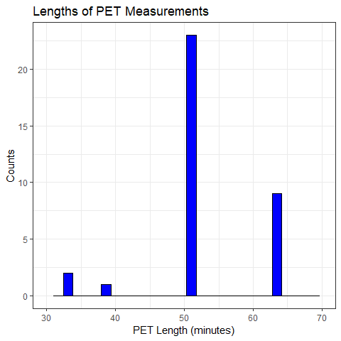
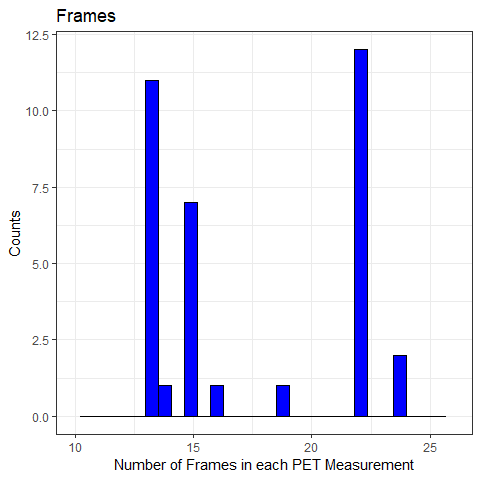
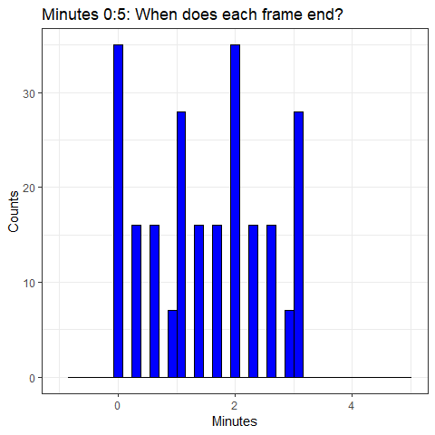
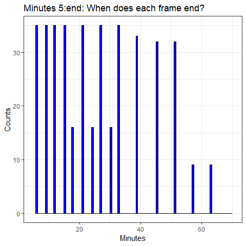
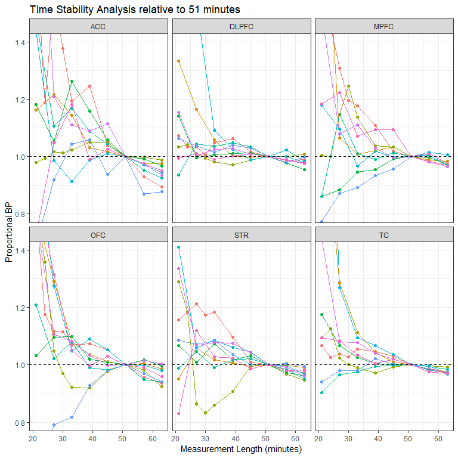
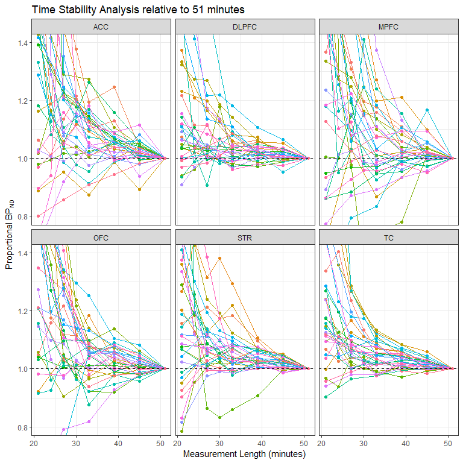
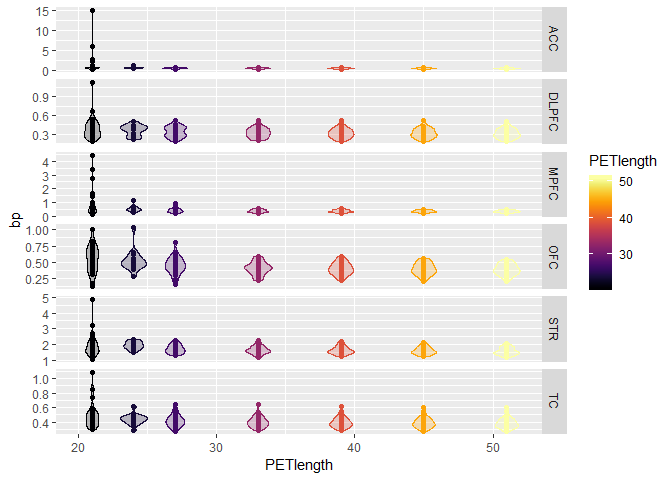
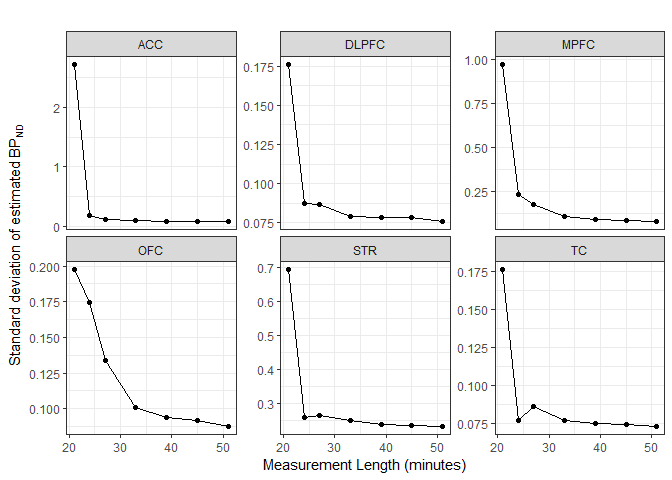
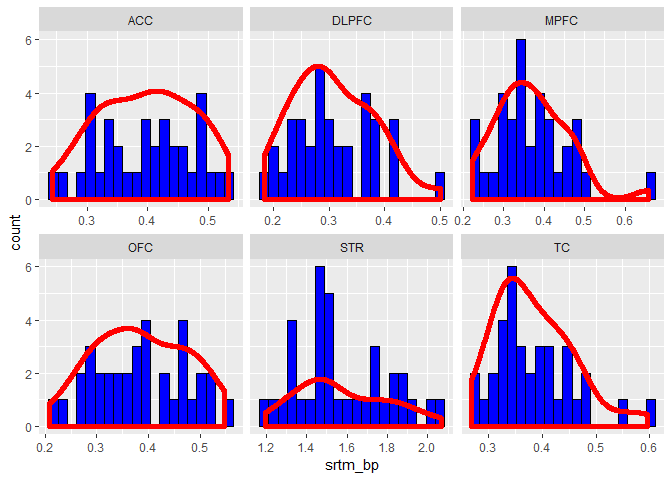
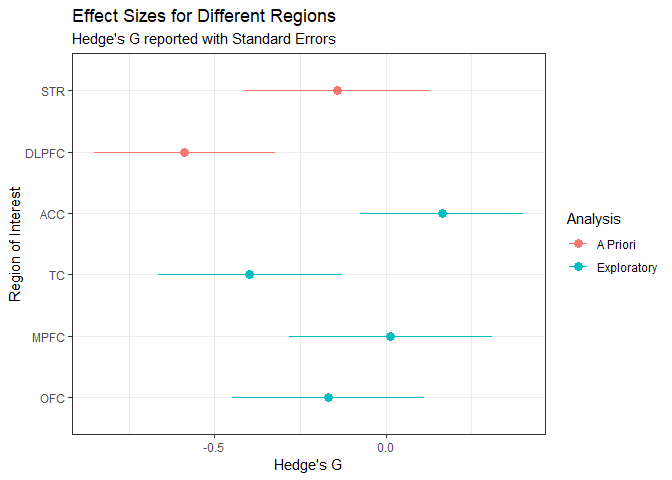

-   [Aims](#aims)
-   [Munging TACs](#munging-tacs)
    -   [Libraries](#libraries)
    -   [Data](#data)
    -   [Extract from that data](#extract-from-that-data)
    -   [Removing frames without
        participants](#removing-frames-without-participants)
-   [Exploring the Frame Properties of the
    TACs](#exploring-the-frame-properties-of-the-tacs)
-   [Are the different TAC lengths a problem? Time Stability
    analysis](#are-the-different-tac-lengths-a-problem-time-stability-analysis)
    -   [Long measurements](#long-measurements)
    -   [51 Minute Data](#minute-data)
    -   [Variance across time ranges](#variance-across-time-ranges)
-   [Binding potential analysis](#binding-potential-analysis)
    -   [Preparing the long data](#preparing-the-long-data)
    -   [Calculating BP<sub>ND</sub> values](#calculating-bpnd-values)
    -   [Correcting for bias](#correcting-for-bias)
-   [Combining the TAC data with the
    metadata](#combining-the-tac-data-with-the-metadata)
    -   [Frequentist Approach](#frequentist-approach)
        -   [Analysis](#analysis)

Aims
====

In this analysis, we aim to analyse the TAC data from the D1
schizophrenia control study.

The relevant issues which need to be confronted prior to analysis are:

-   Different lengths of the PET measurements
-   Different lengths of PET frames

The relevant concerns which need to be addressed during the analysis
phase are:

-   Time-stability of D1R BP<sub>ND</sub> estimates
-   Relevance of T1 and T2 MR measurements
-   Relevance of having the neuroinsert
-   Relevance of automatic and manual ROIs

Munging TACs
============

Libraries
---------

``` r
# devtools::install_github('mathesong/kipettools')
# devtools::install_github("mathesong/kinfitr", ref="v0.2.0")
library(kipettools)
library(tidyverse)
```

    ## -- Attaching packages ------------------------------------------------------------------------------------ tidyverse 1.2.1 --

    ## v ggplot2 3.1.0       v purrr   0.3.0  
    ## v tibble  2.0.1       v dplyr   0.8.0.1
    ## v tidyr   0.8.2       v stringr 1.4.0  
    ## v readr   1.3.1       v forcats 0.4.0

    ## Warning: package 'ggplot2' was built under R version 3.5.2

    ## Warning: package 'tibble' was built under R version 3.5.2

    ## Warning: package 'tidyr' was built under R version 3.5.1

    ## Warning: package 'readr' was built under R version 3.5.2

    ## Warning: package 'purrr' was built under R version 3.5.2

    ## Warning: package 'dplyr' was built under R version 3.5.2

    ## Warning: package 'stringr' was built under R version 3.5.2

    ## Warning: package 'forcats' was built under R version 3.5.2

    ## -- Conflicts --------------------------------------------------------------------------------------- tidyverse_conflicts() --
    ## x dplyr::filter() masks stats::filter()
    ## x dplyr::lag()    masks stats::lag()

``` r
library(kinfitr)
library(viridis)
```

    ## Loading required package: viridisLite

``` r
library(knitr)
library(readxl)
```

    ## Warning: package 'readxl' was built under R version 3.5.1

``` r
library(broom)
```

    ## Warning: package 'broom' was built under R version 3.5.2

``` r
library(lubridate)
```

    ## 
    ## Attaching package: 'lubridate'

    ## The following object is masked from 'package:base':
    ## 
    ##     date

``` r
library(corrplot)
```

    ## corrplot 0.84 loaded

``` r
library(stringr)
library(ggbeeswarm)
library(R2jags)
```

    ## Loading required package: rjags

    ## Loading required package: coda

    ## Linked to JAGS 4.2.0

    ## Loaded modules: basemod,bugs

    ## 
    ## Attaching package: 'R2jags'

    ## The following object is masked from 'package:coda':
    ## 
    ##     traceplot

``` r
library(polspline)
library(TOSTER)
library(rstan)
```

    ## Loading required package: StanHeaders

    ## rstan (Version 2.17.3, GitRev: 2e1f913d3ca3)

    ## For execution on a local, multicore CPU with excess RAM we recommend calling
    ## options(mc.cores = parallel::detectCores()).
    ## To avoid recompilation of unchanged Stan programs, we recommend calling
    ## rstan_options(auto_write = TRUE)

    ## 
    ## Attaching package: 'rstan'

    ## The following object is masked from 'package:R2jags':
    ## 
    ##     traceplot

    ## The following object is masked from 'package:coda':
    ## 
    ##     traceplot

    ## The following object is masked from 'package:tidyr':
    ## 
    ##     extract

``` r
library(MCMCvis)
```

We also use a script from StackOverflow

``` r
# From https://stackoverflow.com/questions/35717353/split-violin-plot-with-ggplot2

GeomSplitViolin <- ggproto("GeomSplitViolin", GeomViolin, draw_group = function(self, data, ..., draw_quantiles = NULL){
  data <- transform(data, xminv = x - violinwidth * (x - xmin), xmaxv = x + violinwidth * (xmax - x))
  grp <- data[1,'group']
  newdata <- plyr::arrange(transform(data, x = if(grp%%2==1) xminv else xmaxv), if(grp%%2==1) y else -y)
  newdata <- rbind(newdata[1, ], newdata, newdata[nrow(newdata), ], newdata[1, ])
  newdata[c(1,nrow(newdata)-1,nrow(newdata)), 'x'] <- round(newdata[1, 'x']) 
  if (length(draw_quantiles) > 0 & !scales::zero_range(range(data$y))) {
    stopifnot(all(draw_quantiles >= 0), all(draw_quantiles <= 
                                              1))
    quantiles <- ggplot2:::create_quantile_segment_frame(data, draw_quantiles)
    aesthetics <- data[rep(1, nrow(quantiles)), setdiff(names(data), c("x", "y")), drop = FALSE]
    aesthetics$alpha <- rep(1, nrow(quantiles))
    both <- cbind(quantiles, aesthetics)
    quantile_grob <- GeomPath$draw_panel(both, ...)
    ggplot2:::ggname("geom_split_violin", grid::grobTree(GeomPolygon$draw_panel(newdata, ...), quantile_grob))
  }
  else {
    ggplot2:::ggname("geom_split_violin", GeomPolygon$draw_panel(newdata, ...))
  }
})

geom_split_violin <- function (mapping = NULL, data = NULL, stat = "ydensity", position = "identity", ..., draw_quantiles = NULL, trim = TRUE, scale = "area", na.rm = FALSE, show.legend = NA, inherit.aes = TRUE) {
  layer(data = data, mapping = mapping, stat = stat, geom = GeomSplitViolin, position = position, show.legend = show.legend, inherit.aes = inherit.aes, params = list(trim = trim, scale = scale, draw_quantiles = draw_quantiles, na.rm = na.rm, ...))
}
```

Data
----

``` r
kfresults_files <- list.files(path = 'RawData/', pattern = 'kinfitresults.mat')
kfresults_paths <- list.files(path = 'RawData/', pattern = 'kinfitresults.mat', full.names = T)

alldata <- tibble(file = kfresults_files, path = kfresults_paths) %>% 
  group_by(path) %>% 
  mutate(tacdata = map(path, ~kipettools::kfresults_getData(.x)))

saveRDS(alldata, file = 'IntermediateData/alltacdata.rds')
```

Extract from that data
----------------------

``` r
alldata <- readRDS('IntermediateData/alltacdata.rds')

alldata <- alldata %>% 
  mutate(Subjname = map_chr(tacdata, 'Subjname'),
         PETNo = map_dbl(tacdata, 'PETNo'),
         alltacs = map(tacdata, 'tacdata'),
         roisizes = map(tacdata, 'roisizes')) %>% 
  select(-tacdata)
```

    ## Warning: Detecting old grouped_df format, replacing `vars` attribute by
    ## `groups`

Now, one of the files has an un-hashtagged ACC. I’ll just manually add
in the column since I don’t want to re-process the entire dataset for
it.

``` r
alldata$alltacs[[32]]$gmACC <- 
  c(0, 187.5660397, 335.7611048, 345.3854509, 334.0108135, 307.0033409, 271.3879948, 241.3411699, 206.0083449, 182.841558, 148.036641, 130.1509825, 132.8755116, 127.3730884)

alldata$roisizes[[32]]$ROI <- as.character(alldata$roisizes[[32]]$ROI)

alldata$roisizes[[32]]$Volume[alldata$roisizes[[32]]$ROI=="ACC"] = 1
alldata$roisizes[[32]]$ROI[alldata$roisizes[[32]]$ROI=="ACC"] = "gmACC"
```

Now I’ve extracted all the elements into their own nested columns. We
now wish to create weighted averages of the striatal ROIs to create a
whole striatum ROI.

First I’ll define functions for extracting weighted averages, and for
doing this for both of the ROIs that we want

``` r
# Generic combination

combine_tacs <- function(alltacs, roisizes, roinames) {
  roinames <- roinames[order(roinames)]
  alltacs <- select(alltacs, roinames)
  roisizes <- filter(roisizes, ROI %in% roinames) %>% 
    arrange(ROI) %>% 
    mutate(ROI=as.character(ROI))
  
  all_long <- alltacs %>% 
    mutate(frameNo = 1:n()) %>% 
    gather(key = 'ROI', value = 'Radioactivity', -frameNo) %>% 
    full_join(roisizes, by = 'ROI') %>% 
    mutate(weighted_val = Radioactivity * Volume) %>% 
    group_by(frameNo) %>% 
    summarise(outtac = sum(weighted_val) / sum(roisizes$Volume) )
  
  pull(all_long, outtac)

}


# Specific computation

getROIs <- function(alltacs, roisizes) {
  outdf <- select(alltacs, times, weights) %>% 
    mutate(STR = combine_tacs(alltacs, roisizes, c('CAU', 'PUT', 'VST') ),
           DLPFC = combine_tacs(alltacs, roisizes, c('gmDLPF')),
           CBL = combine_tacs(alltacs, roisizes, c('CER')) )
  return(outdf)
}

# modeldata <- alldata %>% 
#   mutate(finaltacs = map2(alltacs, roisizes, ~getROIs(.x, .y)))
```

So this last call doesn’t work, because the DLPFC is sometimes called
DLPF and sometimes DLPC. Let’s just fix this in a for loop and ugly
code.

``` r
for( i in 1:nrow(alldata)) {
  
  # roisizes
  alldata$roisizes[[i]]$ROI <- as.character(alldata$roisizes[[i]]$ROI)
  
  alldata$roisizes[[i]]$ROI[alldata$roisizes[[i]]$ROI=='gmDLPC'] = 'gmDLPFC'
  alldata$roisizes[[i]]$ROI[alldata$roisizes[[i]]$ROI=='gmDLPF'] = 'gmDLPFC'
  
  
  # tacdata
  names(alldata$alltacs[[i]])[names(alldata$alltacs[[i]])=='gmDLPC'] = 'gmDLPFC'
  names(alldata$alltacs[[i]])[names(alldata$alltacs[[i]])=='gmDLPF'] = 'gmDLPFC'
  
}
```

Ok, now let’s fix up that last function

``` r
getROIs <- function(alltacs, roisizes) {
  outdf <- select(alltacs, times, weights, durations) %>% 
    mutate(STR = combine_tacs(alltacs, roisizes, c('CAU', 'PUT', 'VST') ),
           DLPFC = combine_tacs(alltacs, roisizes, c('gmDLPFC')),  # Now using DLPFC
           CBL = combine_tacs(alltacs, roisizes, c('CER')),
           fslSTR = combine_tacs(alltacs, roisizes, c('fslSTR')),
           fslDLPFC = combine_tacs(alltacs, roisizes, c('fslMFG')),
           fslCBL = combine_tacs(alltacs, roisizes, c('RefCBL')),
           ACC = combine_tacs(alltacs, roisizes, c('gmACC')),  # Subj32 not hashtagged
           TC = combine_tacs(alltacs, roisizes, c('gmTC')),
           MPFC = combine_tacs(alltacs, roisizes, c('gmDMPC')),
           OFC = combine_tacs(alltacs, roisizes, c('gmOFC')))
  return(outdf)
}

modeldata <- alldata %>%
  mutate(finaltacs = map2(alltacs, roisizes, ~getROIs(.x, .y))) %>% 
  select(path, Subjname, PETNo, tacs = finaltacs) %>% 
  mutate(Subjname = stringr::str_replace(Subjname, 'D1-schiz_', ''))
```

Removing frames without participants
------------------------------------

Two participants left the camera early. However, the frames after they’d
left are still included. Let’s remove these.

``` r
modeldata_unnested <- unnest(modeldata) %>% 
  group_by(path) %>% 
  mutate(cumTime = cumsum(durations),
         startTime = times - (durations/2))

# This code below is hardcoded to remove the acronyms from the shared code
subj1_out <- 41:43
subj2_out <- 387:389

modeldata_unnested <- modeldata_unnested[-c(subj1_out, subj2_out),]

modeldata <- modeldata_unnested %>% 
  select(-cumTime, -startTime) %>% 
  group_by(path, Subjname, PETNo) %>% 
  nest(.key = 'tacs')
```

Now let’s just split this up into separate data frames for all ROIs and
only manual ROIs so that we don’t always have to filter out the
automated ROIs.

``` r
modeldata_manauto <- modeldata

modeldata <- unnest(modeldata) %>% 
  select(-starts_with('fsl')) %>% 
  group_by(path, Subjname, PETNo) %>% 
  nest(.key = 'tacs')
```

Exploring the Frame Properties of the TACs
==========================================

``` r
modeldata <- modeldata %>% 
  mutate(measLength = map_dbl(tacs, ~sum(.$durations)),
         frames = map_dbl(tacs, ~nrow(.x)-1) )

ggplot(modeldata, aes(x=measLength)) +
  geom_histogram(colour='black', fill='blue') +
  theme_bw() +
  labs(x='PET Length (minutes)',
       y='Counts',
       title='Lengths of PET Measurements') +
  xlim(c(30, 70))
```

    ## Warning: Removed 2 rows containing missing values (geom_bar).



``` r
ggplot(modeldata, aes(x=frames)) +
  geom_histogram(colour='black', fill='blue') +
  theme_bw() +
  labs(x='Number of Frames in each PET Measurement',
       y='Counts',
       title='Frames') + 
  xlim(c(10, 26))
```

    ## Warning: Removed 2 rows containing missing values (geom_bar).



``` r
frameData <- modeldata %>% 
  unnest() %>% 
  mutate(endTime = times + durations/2)

ggplot(frameData, aes(x=endTime)) +
  geom_histogram(colour='black', fill='blue', bins = 40) +
  theme_bw() +
  labs(x='Minutes',
       y='Counts',
       title='Minutes 0:5: When does each frame end?') +
  xlim(c(-1,5))
```

    ## Warning: Removed 408 rows containing non-finite values (stat_bin).

    ## Warning: Removed 1 rows containing missing values (geom_bar).



``` r
ggplot(frameData, aes(x=endTime)) +
  geom_histogram(colour='black', fill='blue', bins = 100) +
  theme_bw() +
  labs(x='Minutes',
       y='Counts',
       title='Minutes 5:end: When does each frame end?') +
  xlim(c(5, 70))
```

    ## Warning: Removed 236 rows containing non-finite values (stat_bin).

    ## Warning: Removed 2 rows containing missing values (geom_bar).



Are the different TAC lengths a problem? Time Stability analysis
================================================================

Long measurements
-----------------

Let’s first look at only the longest measurements

``` r
longmeasurements <- modeldata %>% 
  filter(measLength > 60)


time_stability <- function(tacs, roiname, minlength) {
  tacs$cumtime <- cumsum(tacs$durations)

  out <- tibble(PETlength = tacs$cumtime) %>% 
    mutate(frameNo = 1:n()) %>% 
    filter(PETlength > minlength) %>% 
    group_by(frameNo) %>% 
    mutate(bp = map_dbl(frameNo,
                        ~srtm(t_tac = tacs$times,
                              reftac = tacs$CBL, 
                              roitac = tacs[[roiname]], 
                              weights = tacs$weights,
                              frameStartEnd = c(1,.x))$par$bp, tacs=tacs)) %>% 
    ungroup() %>% 
    select(-frameNo) %>% 
    mutate(ROI = roiname)
  
  return(out)
}


ts_data <- longmeasurements %>% 
  group_by(path) %>% 
  mutate(str_ts = map(tacs, ~time_stability(.x, 'STR', 20))) %>% 
  mutate(dlpfc_ts = map(tacs, ~time_stability(.x, 'DLPFC', 20))) %>% 
  mutate(acc_ts = map(tacs, ~time_stability(.x, 'ACC', 20))) %>% 
  mutate(tc_ts = map(tacs, ~time_stability(.x, 'TC', 20))) %>% 
  mutate(mpfc_ts = map(tacs, ~time_stability(.x, 'MPFC', 20))) %>% 
  mutate(ofc_ts = map(tacs, ~time_stability(.x, 'OFC', 20))) %>% 
  mutate(all_ts = pmap(list(str_ts, dlpfc_ts, acc_ts, tc_ts, mpfc_ts, ofc_ts), 
                            ~bind_rows(str_ts, dlpfc_ts, acc_ts, tc_ts, mpfc_ts, ofc_ts))) %>% 
  select(-str_ts, -dlpfc_ts, -acc_ts, -tc_ts, -mpfc_ts, -ofc_ts, -tacs) %>% 
  unnest() %>% 
  ungroup()

totbp <- ts_data %>% 
  filter( round(PETlength) == 63) %>% 
  rename(totbp = bp) %>% 
  select(-PETlength)

midbp <- ts_data %>% 
  filter( round(PETlength) == 51) %>% 
  rename(midbp = bp) %>% 
  select(-PETlength)

ts_analysis <- full_join(ts_data, totbp) %>% 
  full_join(midbp) %>% 
  mutate(totperc_bp = bp/totbp,
         midperc_bp = bp/midbp)
```

    ## Joining, by = c("path", "Subjname", "PETNo", "measLength", "frames", "ROI")
    ## Joining, by = c("path", "Subjname", "PETNo", "measLength", "frames", "ROI")

And let’s plot that

``` r
ggplot(ts_analysis, aes(x=PETlength, y=midperc_bp, colour=Subjname)) +
  geom_point() +
  geom_line() +
  theme_bw() +
  geom_hline(yintercept=1, linetype="dashed") +
  labs(x = 'Measurement Length (minutes)',
       y = 'Proportional BP',
       title='Time Stability Analysis relative to 51 minutes') +
  facet_wrap(ROI~.) +
  guides(colour=FALSE, fill=FALSE) +
  coord_cartesian(ylim = c(0.8, 1.4))
```



Conclusions here:

-   SCH23390 is *not* time-stable
-   If we use the full length, we will be biased for many measures which
    were not so long
-   We have at least 51 minutes of acquisition for all individuals
    except one
-   We also have a time frame which ends at 51 minutes for all
    individuals except one
-   The only individual with the short acquisition has 33 minutes
    -   This is associated with a bias of around about +5%
-   Losing an additional participant is probably worse. Let’s instead
    model the average change and use that for the BP<sub>ND</sub> value.

51 Minute Data
--------------

Now we use all the data for which we have a full 51 minutes

``` r
midmeasurements <- modeldata %>% 
  filter(measLength > 50)

ts_data_mid <- midmeasurements %>% 
  group_by(path) %>% 
  mutate(str_ts = map(tacs, ~time_stability(.x, 'STR', 20))) %>% 
  mutate(dlpfc_ts = map(tacs, ~time_stability(.x, 'DLPFC', 20))) %>% 
  mutate(acc_ts = map(tacs, ~time_stability(.x, 'ACC', 20))) %>% 
  mutate(tc_ts = map(tacs, ~time_stability(.x, 'TC', 20))) %>% 
  mutate(mpfc_ts = map(tacs, ~time_stability(.x, 'MPFC', 20))) %>% 
  mutate(ofc_ts = map(tacs, ~time_stability(.x, 'OFC', 20))) %>% 
  mutate(all_ts = pmap(list(str_ts, dlpfc_ts, acc_ts, tc_ts, mpfc_ts, ofc_ts), 
                            ~bind_rows(str_ts, dlpfc_ts, acc_ts, tc_ts, mpfc_ts, ofc_ts))) %>% 
  select(-str_ts, -dlpfc_ts, -acc_ts, -tc_ts, -mpfc_ts, -ofc_ts, -tacs) %>% 
  unnest() %>% 
  ungroup()


midbp <- ts_data_mid %>% 
  filter( round(PETlength) == 51) %>% 
  rename(midbp = bp) %>% 
  select(-PETlength)

ts_analysis_mid <- full_join(ts_data_mid, midbp) %>% 
  mutate(midperc_bp = bp/midbp) %>% 
  filter( PETlength < 52)
```

    ## Joining, by = c("path", "Subjname", "PETNo", "measLength", "frames", "ROI")

And let’s plot that

``` r
tsplot <- ggplot(ts_analysis_mid, aes(x=PETlength, y=midperc_bp)) +
  geom_point(aes(colour=Subjname)) +
  geom_line(aes(colour=Subjname)) +
  theme_bw() +
  geom_hline(yintercept=1, linetype="dashed") +
  labs(x = 'Measurement Length (minutes)',
       y = expression(paste('Proportional ', BP[ND], sep="")),
       title='Time Stability Analysis relative to 51 minutes') +
  facet_wrap(ROI~.) +
  coord_cartesian(ylim = c(0.8, 1.4)) +
  guides(colour=FALSE)

tsplot
```



``` r
# ggsave('Figures/tsplot.jpg', tsplot, width=6, height=7)
```

And summary statistics

``` r
ts_analysis_mid_summary <- ts_analysis_mid %>%
  mutate(PETlength = round(PETlength)) %>% 
  group_by(PETlength, ROI) %>% 
  summarise(mean_percdif = mean(midperc_bp),
            sd_percdif = sd(midperc_bp),
            mean_bp = mean(bp),
            sd_bp = sd(bp),
            n = n()) %>% 
  arrange(ROI, PETlength)

knitr::kable(ts_analysis_mid_summary, digits=3)
```

|  PETlength| ROI   |  mean\_percdif|  sd\_percdif|  mean\_bp|  sd\_bp|    n|
|----------:|:------|--------------:|------------:|---------:|-------:|----:|
|         21| ACC   |          3.649|       10.212|     1.254|   2.725|   32|
|         24| ACC   |          1.238|        0.382|     0.531|   0.176|   14|
|         27| ACC   |          1.164|        0.195|     0.463|   0.114|   32|
|         30| ACC   |          1.132|        0.104|     0.482|   0.063|   14|
|         33| ACC   |          1.079|        0.096|     0.429|   0.093|   32|
|         39| ACC   |          1.052|        0.057|     0.419|   0.086|   32|
|         45| ACC   |          1.020|        0.040|     0.407|   0.088|   32|
|         51| ACC   |          1.000|        0.000|     0.398|   0.080|   32|
|         21| DLPFC |          1.250|        0.486|     0.387|   0.176|   32|
|         24| DLPFC |          1.123|        0.164|     0.356|   0.087|   14|
|         27| DLPFC |          1.078|        0.115|     0.334|   0.087|   32|
|         30| DLPFC |          1.067|        0.085|     0.335|   0.062|   14|
|         33| DLPFC |          1.035|        0.051|     0.320|   0.079|   32|
|         39| DLPFC |          1.024|        0.030|     0.317|   0.079|   32|
|         45| DLPFC |          1.011|        0.022|     0.313|   0.078|   32|
|         51| DLPFC |          1.000|        0.000|     0.309|   0.076|   32|
|         21| MPFC  |          2.261|        2.658|     0.823|   0.971|   32|
|         24| MPFC  |          1.425|        0.574|     0.516|   0.228|   14|
|         27| MPFC  |          1.221|        0.387|     0.440|   0.177|   32|
|         30| MPFC  |          1.174|        0.282|     0.426|   0.147|   14|
|         33| MPFC  |          1.046|        0.134|     0.376|   0.105|   32|
|         39| MPFC  |          1.026|        0.078|     0.367|   0.091|   32|
|         45| MPFC  |          1.020|        0.041|     0.364|   0.082|   32|
|         51| MPFC  |          1.000|        0.000|     0.357|   0.078|   32|
|         21| OFC   |          1.415|        0.546|     0.546|   0.198|   32|
|         24| OFC   |          1.333|        0.327|     0.527|   0.174|   14|
|         27| OFC   |          1.141|        0.186|     0.447|   0.134|   32|
|         30| OFC   |          1.094|        0.104|     0.432|   0.087|   14|
|         33| OFC   |          1.037|        0.087|     0.404|   0.101|   32|
|         39| OFC   |          1.028|        0.051|     0.399|   0.094|   32|
|         45| OFC   |          1.010|        0.029|     0.392|   0.092|   32|
|         51| OFC   |          1.000|        0.000|     0.388|   0.087|   32|
|         21| STR   |          1.251|        0.534|     1.948|   0.695|   32|
|         24| STR   |          1.215|        0.181|     1.952|   0.258|   14|
|         27| STR   |          1.087|        0.101|     1.715|   0.267|   32|
|         30| STR   |          1.088|        0.126|     1.755|   0.237|   14|
|         33| STR   |          1.052|        0.078|     1.661|   0.251|   32|
|         39| STR   |          1.035|        0.037|     1.635|   0.241|   32|
|         45| STR   |          1.019|        0.017|     1.611|   0.236|   32|
|         51| STR   |          1.000|        0.000|     1.582|   0.233|   32|
|         21| TC    |          1.265|        0.369|     0.488|   0.176|   32|
|         24| TC    |          1.131|        0.129|     0.435|   0.077|   14|
|         27| TC    |          1.096|        0.092|     0.421|   0.086|   32|
|         30| TC    |          1.062|        0.063|     0.408|   0.058|   14|
|         33| TC    |          1.045|        0.048|     0.402|   0.077|   32|
|         39| TC    |          1.032|        0.028|     0.397|   0.075|   32|
|         45| TC    |          1.014|        0.017|     0.390|   0.074|   32|
|         51| TC    |          1.000|        0.000|     0.385|   0.073|   32|

Variance across time ranges
---------------------------

We have shown that there is bias across the time range relative to both
51 and 63 minutes. We can either correct the estimated bias in the
BP<sub>ND</sub> of shorter PET measurements, or else we could possibly
just restrict analysis of all PET meausurements to shorter periods. To
assess the feasibility of this decision, we can examine the standard
deviation of BP<sub>ND</sub> values across time.

``` r
ts_analysis_mid %>% 
  arrange(PETlength) %>% 
  mutate(PETlength = round(PETlength)) %>% 
  filter(PETlength != 30) %>%    # From above, we see that there are fewer PET measurements with 30 minute ends
  ggplot(aes(x=PETlength, y=bp)) +
  geom_point(aes(colour=PETlength)) +
  geom_violin(aes(x=PETlength, group=factor(PETlength), colour=PETlength, fill=PETlength), 
              width=2, alpha=0.25) +
  facet_grid(ROI ~ ., scale='free_y') +
  scale_colour_viridis(option = 'B') +
  scale_fill_viridis(option = 'B')
```



This is not so clear. We can instead plot the SD across the range
directly.

``` r
sdbpplot <- ts_analysis_mid_summary %>% 
  filter(PETlength != 30) %>%    # From above, we see that there are fewer PET measurements with 30 minute ends
  ggplot(aes(x=PETlength, y=sd_bp)) +
  geom_point() +
  geom_line() +
  labs(x = 'Measurement Length (minutes)',
       y = expression(paste('Standard deviation of estimated ', BP[ND], sep="")),
       title='') +
  facet_wrap(ROI ~ ., scale='free_y') +
  theme_bw()
  
sdbpplot
```



``` r
# ggsave('Figures/sdbpplot.jpg', sdbpplot, width=6, height=7)
```

We therefore conclude that longer measurements are preferable as they
show diminished variability. The best solution is therefore to correct
the shorter measurements for potential bias to what they *might* have
been if they had been measured for the whole 51 minutes.

Binding potential analysis
==========================

Preparing the long data
-----------------------

``` r
modeldata_long <- unnest(modeldata) %>% 
  ungroup(modeldata) %>% 
  mutate(frameEnd = times+durations/2) %>% 
  filter(frameEnd < 52) %>% 
  gather(key = 'ROI', value = 'Radioactivity', -path, -Subjname, 
         -PETNo, -measLength, -frames, -times, -CBL,
         -weights, -durations, -frameEnd) %>% 
  arrange(Subjname, PETNo, times) %>% 
  group_by(path, Subjname, PETNo, measLength, frames, ROI) %>% 
  nest(.key = 'tacs')
```

Calculating BP<sub>ND</sub> values
----------------------------------

``` r
modeldata_long <- modeldata_long %>% 
  group_by(path) %>% 
  mutate(srtmout = map(tacs, ~srtm(t_tac = .x$times,
                              reftac = .x$CBL, 
                              roitac = .x$Radioactivity, 
                              weights = .x$weights)),
         srtm_bp = map_dbl(srtmout, c('par', 'bp')))
```

and checking for outliers

``` r
ggplot(modeldata_long, aes(x=srtm_bp)) +
  geom_histogram(colour='black', fill='blue', bins = 20) +
  geom_density(colour="red", size=2) +
  facet_wrap(.~ROI, scale='free_x')
```



Correcting for bias
-------------------

Now we wish to create new BP<sub>ND</sub> values for those individuals
whose measurements were shorter.

``` r
bp_data <- modeldata_long %>%
  ungroup() %>% 
  mutate(measLength = map_dbl(tacs, ~round(sum(.$durations))),
         frames = map_dbl(tacs, ~nrow(.x)-1) ) %>% 
  select(Subjname, PETNo, ROI, measLength, frames, rawbp = srtm_bp) %>% 
  left_join(select(ts_analysis_mid_summary, 
                   measLength=PETlength, ROI, mean_percdif)) %>% 
  mutate(bp = rawbp/mean_percdif)
```

    ## Joining, by = c("ROI", "measLength")

Combining the TAC data with the metadata
========================================

Reading in the file

``` r
demographics <- read_excel('RawData/D1 schiz demographics.xlsx') %>% 
  select(id, CtrPat = `ctr/pat`, Age =`Age (yr)`, `PET date`, MBq, ecat=`ecat6 / ecat7 file`,
         NeuroInsert=`Neuro-incert`, PET2D3D=`2D/3D`, rzfilter_res=`r-z filter resolution`,
         filtercutoff_freq = `Filter cutoff frequency`, MRI, Sex=`m/f`,
         pairNo = `h#/p#`) %>% 
  filter(!is.na( CtrPat)) %>% 
  mutate(Subjname = stringr::str_replace(id, '[0-9]', '')) %>% 
  mutate(pairNo = as.numeric(stringr::str_replace(pairNo, '[hp]', '')))
```

There are hidden rows in the sheet which mess things up. Had to filter
by missing values in CtrPat to fix this.

And combining with the bp data

``` r
bp_data <- left_join(bp_data, demographics)
```

    ## Joining, by = "Subjname"

Frequentist Approach
--------------------

### Analysis

``` r
bp_data_test <- bp_data %>% 
  group_by(ROI) %>% 
  mutate(bp.z = as.numeric(scale(bp)),
         bp.cent = as.numeric(scale(bp, center=T, scale=F)))

roitests <- bp_data_test %>% 
  group_by(ROI) %>% 
  nest() %>% 
  group_by(ROI) %>% 
  mutate(groupcomp = map(data, ~lm(bp.z ~ Age + CtrPat, data=.x)))
```

#### Effect Size

``` r
roitests <- roitests %>% 
  group_by(ROI) %>% 
  mutate(ES = map(groupcomp, 
                  ~compute.es::a.tes(t = summary(.x)$coefficients[3,3], 
                  n.1 = 17, 
                  n.2 = 18, 
                  R = cor(.x$model$bp.z, .x$model$Age), 
                  q = 1, 
                  dig = 3, 
                  level = 68.26895)))
```

    ## Mean Differences ES: 
    ##  
    ##  d [ 68.26895 %CI] = 0.167 [ -0.077 , 0.411 ] 
    ##   var(d) = 0.058 
    ##   p-value(d) = 0.492 
    ##   U3(d) = 56.632 % 
    ##   CLES(d) = 54.7 % 
    ##   Cliff's Delta = 0.094 
    ##  
    ##  g [ 68.26895 %CI] = 0.163 [ -0.075 , 0.401 ] 
    ##   var(g) = 0.055 
    ##   p-value(g) = 0.492 
    ##   U3(g) = 56.477 % 
    ##   CLES(g) = 54.59 % 
    ##  
    ##  Correlation ES: 
    ##  
    ##  r [ 68.26895 %CI] = 0.083 [ -0.096 , 0.257 ] 
    ##   var(r) = 0.014 
    ##   p-value(r) = 0.64 
    ##  
    ##  z [ 68.26895 %CI] = 0.083 [ -0.096 , 0.263 ] 
    ##   var(z) = 0.031 
    ##   p-value(z) = 0.64 
    ##  
    ##  Odds Ratio ES: 
    ##  
    ##  OR [ 68.26895 %CI] = 1.354 [ 0.869 , 2.108 ] 
    ##   p-value(OR) = 0.492 
    ##  
    ##  Log OR [ 68.26895 %CI] = 0.303 [ -0.14 , 0.746 ] 
    ##   var(lOR) = 0.19 
    ##   p-value(Log OR) = 0.492 
    ##  
    ##  Other: 
    ##  
    ##  NNT = 20.016 
    ##  Total N = 35Mean Differences ES: 
    ##  
    ##  d [ 68.26895 %CI] = -0.602 [ -0.873 , -0.331 ] 
    ##   var(d) = 0.071 
    ##   p-value(d) = 0.031 
    ##   U3(d) = 27.344 % 
    ##   CLES(d) = 33.506 % 
    ##   Cliff's Delta = -0.33 
    ##  
    ##  g [ 68.26895 %CI] = -0.588 [ -0.853 , -0.324 ] 
    ##   var(g) = 0.068 
    ##   p-value(g) = 0.031 
    ##   U3(g) = 27.819 % 
    ##   CLES(g) = 33.873 % 
    ##  
    ##  Correlation ES: 
    ##  
    ##  r [ 68.26895 %CI] = -0.288 [ -0.443 , -0.117 ] 
    ##   var(r) = 0.014 
    ##   p-value(r) = 0.103 
    ##  
    ##  z [ 68.26895 %CI] = -0.297 [ -0.476 , -0.117 ] 
    ##   var(z) = 0.031 
    ##   p-value(z) = 0.103 
    ##  
    ##  Odds Ratio ES: 
    ##  
    ##  OR [ 68.26895 %CI] = 0.335 [ 0.205 , 0.548 ] 
    ##   p-value(OR) = 0.031 
    ##  
    ##  Log OR [ 68.26895 %CI] = -1.093 [ -1.584 , -0.601 ] 
    ##   var(lOR) = 0.234 
    ##   p-value(Log OR) = 0.031 
    ##  
    ##  Other: 
    ##  
    ##  NNT = -7.959 
    ##  Total N = 35Mean Differences ES: 
    ##  
    ##  d [ 68.26895 %CI] = 0.014 [ -0.289 , 0.316 ] 
    ##   var(d) = 0.089 
    ##   p-value(d) = 0.964 
    ##   U3(d) = 50.542 % 
    ##   CLES(d) = 50.383 % 
    ##   Cliff's Delta = 0.008 
    ##  
    ##  g [ 68.26895 %CI] = 0.013 [ -0.282 , 0.309 ] 
    ##   var(g) = 0.085 
    ##   p-value(g) = 0.964 
    ##   U3(g) = 50.529 % 
    ##   CLES(g) = 50.374 % 
    ##  
    ##  Correlation ES: 
    ##  
    ##  r [ 68.26895 %CI] = 0.007 [ -0.171 , 0.184 ] 
    ##   var(r) = 0.022 
    ##   p-value(r) = 0.97 
    ##  
    ##  z [ 68.26895 %CI] = 0.007 [ -0.173 , 0.186 ] 
    ##   var(z) = 0.031 
    ##   p-value(z) = 0.97 
    ##  
    ##  Odds Ratio ES: 
    ##  
    ##  OR [ 68.26895 %CI] = 1.025 [ 0.592 , 1.775 ] 
    ##   p-value(OR) = 0.964 
    ##  
    ##  Log OR [ 68.26895 %CI] = 0.025 [ -0.524 , 0.574 ] 
    ##   var(lOR) = 0.292 
    ##   p-value(Log OR) = 0.964 
    ##  
    ##  Other: 
    ##  
    ##  NNT = 261.501 
    ##  Total N = 35Mean Differences ES: 
    ##  
    ##  d [ 68.26895 %CI] = -0.173 [ -0.461 , 0.114 ] 
    ##   var(d) = 0.08 
    ##   p-value(d) = 0.544 
    ##   U3(d) = 43.115 % 
    ##   CLES(d) = 45.12 % 
    ##   Cliff's Delta = -0.098 
    ##  
    ##  g [ 68.26895 %CI] = -0.169 [ -0.45 , 0.111 ] 
    ##   var(g) = 0.076 
    ##   p-value(g) = 0.544 
    ##   U3(g) = 43.277 % 
    ##   CLES(g) = 45.234 % 
    ##  
    ##  Correlation ES: 
    ##  
    ##  r [ 68.26895 %CI] = -0.086 [ -0.26 , 0.093 ] 
    ##   var(r) = 0.02 
    ##   p-value(r) = 0.628 
    ##  
    ##  z [ 68.26895 %CI] = -0.087 [ -0.266 , 0.093 ] 
    ##   var(z) = 0.031 
    ##   p-value(z) = 0.628 
    ##  
    ##  Odds Ratio ES: 
    ##  
    ##  OR [ 68.26895 %CI] = 0.73 [ 0.434 , 1.229 ] 
    ##   p-value(OR) = 0.544 
    ##  
    ##  Log OR [ 68.26895 %CI] = -0.315 [ -0.835 , 0.206 ] 
    ##   var(lOR) = 0.263 
    ##   p-value(Log OR) = 0.544 
    ##  
    ##  Other: 
    ##  
    ##  NNT = -22.242 
    ##  Total N = 35Mean Differences ES: 
    ##  
    ##  d [ 68.26895 %CI] = -0.145 [ -0.423 , 0.133 ] 
    ##   var(d) = 0.075 
    ##   p-value(d) = 0.601 
    ##   U3(d) = 44.24 % 
    ##   CLES(d) = 45.92 % 
    ##   Cliff's Delta = -0.082 
    ##  
    ##  g [ 68.26895 %CI] = -0.141 [ -0.413 , 0.13 ] 
    ##   var(g) = 0.072 
    ##   p-value(g) = 0.601 
    ##   U3(g) = 44.375 % 
    ##   CLES(g) = 46.016 % 
    ##  
    ##  Correlation ES: 
    ##  
    ##  r [ 68.26895 %CI] = -0.072 [ -0.247 , 0.107 ] 
    ##   var(r) = 0.018 
    ##   p-value(r) = 0.685 
    ##  
    ##  z [ 68.26895 %CI] = -0.072 [ -0.252 , 0.107 ] 
    ##   var(z) = 0.031 
    ##   p-value(z) = 0.685 
    ##  
    ##  Odds Ratio ES: 
    ##  
    ##  OR [ 68.26895 %CI] = 0.769 [ 0.464 , 1.274 ] 
    ##   p-value(OR) = 0.601 
    ##  
    ##  Log OR [ 68.26895 %CI] = -0.263 [ -0.768 , 0.242 ] 
    ##   var(lOR) = 0.247 
    ##   p-value(Log OR) = 0.601 
    ##  
    ##  Other: 
    ##  
    ##  NNT = -26.274 
    ##  Total N = 35Mean Differences ES: 
    ##  
    ##  d [ 68.26895 %CI] = -0.407 [ -0.682 , -0.132 ] 
    ##   var(d) = 0.073 
    ##   p-value(d) = 0.142 
    ##   U3(d) = 34.19 % 
    ##   CLES(d) = 38.668 % 
    ##   Cliff's Delta = -0.227 
    ##  
    ##  g [ 68.26895 %CI] = -0.398 [ -0.666 , -0.129 ] 
    ##   var(g) = 0.07 
    ##   p-value(g) = 0.142 
    ##   U3(g) = 34.544 % 
    ##   CLES(g) = 38.928 % 
    ##  
    ##  Correlation ES: 
    ##  
    ##  r [ 68.26895 %CI] = -0.199 [ -0.364 , -0.023 ] 
    ##   var(r) = 0.016 
    ##   p-value(r) = 0.261 
    ##  
    ##  z [ 68.26895 %CI] = -0.202 [ -0.382 , -0.023 ] 
    ##   var(z) = 0.031 
    ##   p-value(z) = 0.261 
    ##  
    ##  Odds Ratio ES: 
    ##  
    ##  OR [ 68.26895 %CI] = 0.478 [ 0.29 , 0.787 ] 
    ##   p-value(OR) = 0.142 
    ##  
    ##  Log OR [ 68.26895 %CI] = -0.739 [ -1.237 , -0.24 ] 
    ##   var(lOR) = 0.241 
    ##   p-value(Log OR) = 0.142 
    ##  
    ##  Other: 
    ##  
    ##  NNT = -10.621 
    ##  Total N = 35

``` r
roitests <- roitests %>% 
  mutate(HG_estimate = map_dbl(ES, "g"),
         HG_lower = map_dbl(ES, "l.g"),
         HG_upper = map_dbl(ES, "u.g")) %>% 
  ungroup() %>% 
  mutate(ROI = forcats::fct_inorder(ROI),
         ROI = forcats::fct_rev(ROI),
         Analysis = c(rep("A Priori", 2), rep("Exploratory", 4)))
```

And plot

``` r
roicompareplot <- 
  ggplot(roitests, aes(x=HG_estimate, y=ROI, colour=Analysis)) +
  geom_point(size=3) +
  geom_errorbarh(aes(xmin=HG_lower, xmax=HG_upper), height=0) +
  theme_bw() +
  labs(x="Hedge's G", y="Region of Interest",
       title="Effect Sizes for Different Regions",
       subtitle="Hedge's G reported with Standard Errors")
  
print(roicompareplot)
```



``` r
ggsave(roicompareplot, filename = "Figures/roicompareplot.jpg")
```

    ## Saving 7 x 5 in image

And summaries

``` r
roitests <- roitests %>% 
  mutate(summarytab = map2(groupcomp, ROI,
                          ~tidy(.x)))


walk2(roitests$summarytab, roitests$ROI, ~print(kable(.x, digits = 3, caption = .y)))
```

| term        |  estimate|  std.error|  statistic|  p.value|
|:------------|---------:|----------:|----------:|--------:|
| (Intercept) |     2.045|      0.510|      4.007|      0.0|
| Age         |    -0.065|      0.016|     -3.970|      0.0|
| CtrPatpat   |    -0.151|      0.285|     -0.530|      0.6|

| term        |  estimate|  std.error|  statistic|  p.value|
|:------------|---------:|----------:|----------:|--------:|
| (Intercept) |     2.344|      0.445|      5.268|    0.000|
| Age         |    -0.067|      0.014|     -4.731|    0.000|
| CtrPatpat   |    -0.583|      0.249|     -2.345|    0.025|

| term        |  estimate|  std.error|  statistic|  p.value|
|:------------|---------:|----------:|----------:|--------:|
| (Intercept) |     2.383|      0.446|      5.346|    0.000|
| Age         |    -0.081|      0.014|     -5.712|    0.000|
| CtrPatpat   |     0.174|      0.249|      0.697|    0.491|

| term        |  estimate|  std.error|  statistic|  p.value|
|:------------|---------:|----------:|----------:|--------:|
| (Intercept) |     2.194|      0.482|      4.553|    0.000|
| Age         |    -0.065|      0.015|     -4.236|    0.000|
| CtrPatpat   |    -0.412|      0.269|     -1.530|    0.136|

| term        |  estimate|  std.error|  statistic|  p.value|
|:------------|---------:|----------:|----------:|--------:|
| (Intercept) |     1.617|      0.559|      2.895|    0.007|
| Age         |    -0.053|      0.018|     -2.995|    0.005|
| CtrPatpat   |     0.014|      0.312|      0.046|    0.964|

| term        |  estimate|  std.error|  statistic|  p.value|
|:------------|---------:|----------:|----------:|--------:|
| (Intercept) |     1.928|      0.525|      3.672|    0.001|
| Age         |    -0.060|      0.017|     -3.599|    0.001|
| CtrPatpat   |    -0.181|      0.294|     -0.615|    0.543|

And next, let’s provide means and standard deviations for each group

``` r
roisummaries <- roitests %>% 
  ungroup() %>% 
  select(ROI, data) %>% 
  unnest() %>% 
  group_by(ROI, CtrPat) %>% 
  summarise(Mean = mean(bp), SD = sd(bp)) %>% 
  rename(PatientControl = CtrPat) %>% 
  mutate(PatientControl = ifelse(PatientControl=="ctr",
                                 "Control", "Patient")) %>% 
  mutate(Summary = paste0(round(Mean, 3), ' (', 
                          round(SD, 3), ")")) %>% 
  select(-Mean, -SD) %>% 
  ungroup() %>% 
  spread(PatientControl, Summary) %>% 
  mutate(ROI = forcats::fct_inorder(ROI),
         ROI = forcats::fct_rev(ROI)) %>% 
  arrange(desc(as.numeric(rownames(roitests)))) %>% 
  mutate(Analysis = c(rep("A Priori", 2), rep("Exploratory", 4))) %>% 
  rename(Region = ROI)

kable(roisummaries, digits=3)
```

| Region | Control       | Patient       | Analysis    |
|:-------|:--------------|:--------------|:------------|
| STR    | 1.613 (0.245) | 1.531 (0.21)  | A Priori    |
| DLPFC  | 0.337 (0.075) | 0.278 (0.061) | A Priori    |
| ACC    | 0.398 (0.067) | 0.391 (0.089) | Exploratory |
| TC     | 0.406 (0.078) | 0.36 (0.063)  | Exploratory |
| MPFC   | 0.373 (0.076) | 0.359 (0.098) | Exploratory |
| OFC    | 0.4 (0.089)   | 0.367 (0.09)  | Exploratory |
